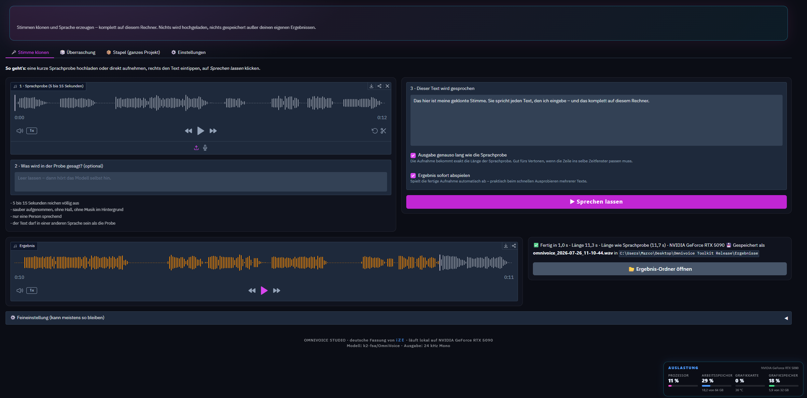
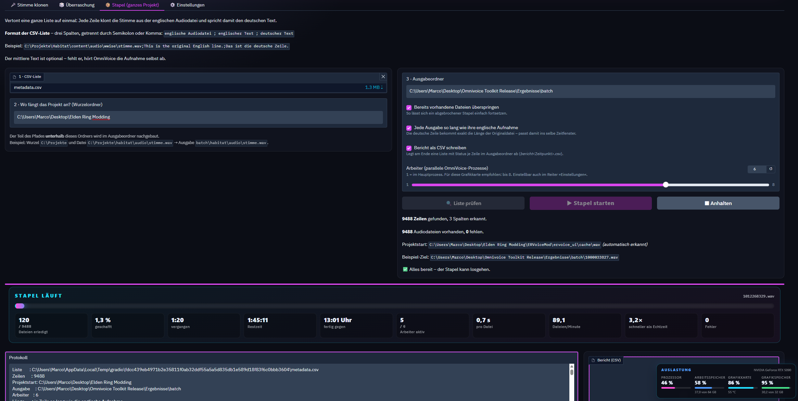

# OmniVoice Studio

> **Deutsche Ein-Klick-Installation für lokale Stimmklonung.**
> Eine Datei anklicken – Python, PyTorch, OmniVoice, Faster-Whisper und die Standardmodelle
> richten sich von allein ein.
> Alles rechnet auf dem eigenen Rechner: keine Audio-Cloud, keine Telemetrie.

Von **iZE**. Sprachmodell: [k2-fsa/OmniVoice](https://huggingface.co/k2-fsa/OmniVoice).

---

## Inhalt

**Für Anwender**

- [Was ist das?](#was-ist-das)
- [Voraussetzungen](#voraussetzungen)
- [Loslegen](#loslegen)
- [Die Oberfläche](#die-oberfläche)
- [Lange Szenen und Cutscenes](#lange-szenen-und-cutscenes)
- [CSV-Listen aus Audioordnern erzeugen](#csv-listen-aus-audioordnern-erzeugen)
- [Stapelbetrieb: ein ganzes Projekt vertonen](#stapelbetrieb-ein-ganzes-projekt-vertonen)
- [Übersetzen](#übersetzen)
- [Mehrere Arbeiter](#mehrere-arbeiter)
- [Einstellungen](#einstellungen)
- [Wo liegt was?](#wo-liegt-was)
- [Wenn etwas klemmt](#wenn-etwas-klemmt)
- [Wieder loswerden](#wieder-loswerden)

**Technische Notizen**

- [Aufbau](#aufbau)
- [Ablauf der Installation](#ablauf-der-installation)
- [Fenstergröße und Anzeige](#fenstergröße-und-anzeige)
- [Die Web-Oberfläche: Umsetzung](#die-web-oberfläche-umsetzung)
- [Stapelbetrieb: Umsetzung](#stapelbetrieb-umsetzung)
- [Arbeiter: Umsetzung](#arbeiter-umsetzung)
- [Länge und Klang](#länge-und-klang)
- [Erweiterte Ansicht: Umsetzung](#erweiterte-ansicht-umsetzung)
- [Szenen-Editor: Umsetzung](#szenen-editor-umsetzung)
- [Auslastungsanzeige: Umsetzung](#auslastungsanzeige-umsetzung)
- [Benachrichtigung nach dem Stapel](#benachrichtigung-nach-dem-stapel)
- [Sprache der Oberfläche](#sprache-der-oberfläche)
- [Gradio-Fallstricke](#gradio-fallstricke)
- [Bewusste Festlegungen](#bewusste-festlegungen)
- [Neu installieren](#neu-installieren)

---

## Was ist das?

OmniVoice klont Stimmen: Du gibst eine kurze Sprachaufnahme und einen Text vor – heraus kommt
der Text, gesprochen mit dieser Stimme. Das Modell beherrscht über 600 Sprachen, die Vorlage
darf also englisch sein und der Text deutsch.

Dieses Studio nimmt die komplette Einrichtung ab und legt eine deutsche Bedienoberfläche
darüber. Es gibt genau **eine Datei zum Anklicken**: `STARTEN.bat`. Beim ersten Mal richtet
sie alles ein, danach startet sie OmniVoice direkt durch.

```
╔══════════════════════════════════════════════════════════════════════════════════════════════╗
║                         O M N I V O I C E   S T U D I O    ·    iZE                          ║
║     ▅▅▅▄▄▄▃▃▃▃▃▄▄▅▅▆▇▇██████▇▇▆▆▅▅▄▄▃▃▃▃▃▄▄▄▅▅▆▆▆▆▆▆▅▅▄▄▃▃▂▂▂▂   ║
║ NVIDIA CUDA 12.8 · NVIDIA GeForce RTX 5090   ·   Zustand: noch nicht installiert   ·   00:12 ║
╠══════════════════════════════════════════════════════════════════════════════════════════════╣
║                                      H A U P T M E N Ü                                       ║
║                                                                                              ║
║   ▶ [1]  OMNIVOICE INSTALLIEREN                                                             ║
║          Richtet alles vollautomatisch ein · ca. 12–16 GB · 20 bis 60 Minuten                ║
║                                                                                              ║
║     [2]  OMNIVOICE STARTEN                                                                   ║
║          Öffnet die Bedienoberfläche im Browser                                              ║
║                                                                                              ║
║     [3]  SYSTEM PRÜFEN                                                                       ║
║          Grafikkarte, Speicherplatz und Installation testen                                  ║
║                                                                                              ║
║     [4]  REPARIEREN                                                                          ║
║          Bei Problemen: Programm neu aufbauen, Sprachmodell bleibt erhalten                  ║
║                                                                                              ║
║     [5]  NACH UPDATES SUCHEN                                                                 ║
║          Programmversion mit GitHub vergleichen                                              ║
║                                                                                              ║
║     [6]  HILFE UND INFOS                                                                     ║
║          Was passiert hier? Wo liegt was? Was tun bei Fehlern?                               ║
║                                                                                              ║
║     [0]  BEENDEN                                                                             ║
║                                                                                              ║
║                    Noch nichts installiert. Tipp: Einfach ENTER drücken.                     ║
╠══════════════════════════════════════════════════════════════════════════════════════════════╣
║        ↑↓ auswählen   ·   ENTER öffnen   ·   Zifferntasten direkt   ·   ESC beenden          ║
║                                            Bereit                                            ║
╚══════════════════════════════════════════════════════════════════════════════════════════════╝
```

---

## Voraussetzungen

| | |
|---|---|
| **Betriebssystem** | Windows 10 oder 11 |
| **Python** | 3.10 bis 3.13 – fehlt eine passende Version, richtet das Studio Python 3.12 zusätzlich ein; vorhandenes Python 3.14+ bleibt unberührt |
| **Speicherplatz** | ungefähr 12 bis 16 GB inklusive OmniVoice, Whisper, Pyannote und Demucs; zur Installation sollten mindestens 22 GB frei sein |
| **Internet** | nur für Installation und Updateprüfung |
| **Grafikkarte** | optional. NVIDIA mit Treiber 570+ → CUDA 12.8, Intel Arc → XPU, sonst Prozessor |

Ohne Grafikkarte läuft alles über den Prozessor – funktioniert, ist aber deutlich langsamer.

---

## Loslegen

1. Ordner `toolkit` herunterladen und irgendwohin entpacken
2. **`STARTEN.bat` doppelklicken**
3. Im Menü <kbd>ENTER</kbd> drücken und warten (20 bis 60 Minuten, je nach Leitung und Gerät)

Ab dem zweiten Mal führt dieselbe Datei direkt ins Menü, in dem »OmniVoice starten« schon
vorgewählt ist – <kbd>ENTER</kbd> genügt.

Bei einer bestehenden Installation ohne Faster-Whisper oder Cutscene-Werkzeuge wird einmalig
**„Sprach- und Cutscene-Werkzeuge ergänzen“** vorgewählt. Dieser Ergänzungslauf fasst die
vorhandene OmniVoice-/PyTorch-Umgebung nicht an und richtet die getrennten Whisper- und
Szenen-Umgebungen ein.

Ein Abbruch ist ungefährlich: Beim nächsten Start wird dort weitergemacht, wo es aufgehört
hat. Jeder Schritt zeigt Fortschritt, Tempo und Restzeit, dazu eine Gesamtrestzeit, die sich
am tatsächlich gemessenen Download-Tempo nachjustiert.

```
╔══════════════════════════════════════════════════════════════════════════════════════════════╗
║                                      INSTALLATION LÄUFT                                      ║
║                        Schritt 5 von 12: KI-Motor PyTorch installieren                       ║
║                                                                                              ║
║ GESAMT   [██████████▒·······························]  24,8 %   noch ca. 14:43               ║
║ SCHRITT  [▓▓▓▓▓▓▓▓▓▓▓▓▓▓▓▓▓▒░░░░░░░░░░░░░░░░░░░░░░░░]  42,0 %   noch ca. 06:54               ║
║ DATEN    1,4 GB von 3,4 GB   ·   32,6 MB/s   ·   noch ca. 01:00                              ║
║ DATEI    torch-2.8.0+cu128-cp312-cp312-win_amd64.whl                                         ║
║                                                                                              ║
║   ✔  1. System prüfen                        00:18   Python, Speicherplatz und Internet     ║
║   ✔  2. Arbeitsumgebung anlegen              00:24   abgeschotteter Python-Bereich          ║
║   ✔  3. Paketverwaltung aktualisieren        00:31   pip, setuptools und wheel              ║
║   ✔  4. Grafikkarte erkennen                 00:02   passende Beschleunigung wählen         ║
║   ⠧  5. KI-Motor PyTorch installieren        05:00   der größte Brocken                      ║
║   ·  6. OmniVoice installieren           ca. 01:51   Programm samt Zubehör – ca. 600 MB      ║
║   ·  7. Sprachmodell herunterladen       ca. 04:52   k2-fsa/OmniVoice – ca. 3,3 GB           ║
║   ·  8. Installation testen              ca. 01:00   läuft alles, läuft die Grafikkarte?     ║
║   ·  9. Abschließen                      ca. 00:05   Einstellungen sichern                   ║
║                                                                                              ║
║ LIVE-PROTOKOLL                                    ▲▼ blättern · Zeile 53–60 von 60 · am Ende ║
║ Downloading torch-2.8.0+cu128-cp312-cp312-win_amd64.whl (3461.4 MB)                        │ ║
║ Installing collected packages: mpmath, typing-extensions, sympy, networkx …                █ ║
╚══════════════════════════════════════════════════════════════════════════════════════════════╝
```

---

## Die Oberfläche

<a>
  
</a>

Nach der Installation öffnet sich der Browser mit einer deutschen Oberfläche.

### 🎤 Stimme klonen

Sprachprobe hochladen oder direkt per Mikrofon aufnehmen, Text eintippen, fertig.
Der Referenztext ist optional – fehlt er, hört OmniVoice die Aufnahme selbst ab.

Zwei Häkchen:

- **Ausgabe genauso lang wie die Sprachprobe** – die Aufnahme bekommt exakt die Länge der
  Vorlage. Gedacht fürs Vertonen, wenn die Zeile ins selbe Zeitfenster passen muss.
- **Ergebnis sofort abspielen** – praktisch, um schnell mehrere Texte durchzuprobieren.

> **Für gute Klone:** 5 bis 15 Sekunden Probe genügen, sauber aufgenommen, ohne Hall,
> ohne Musik im Hintergrund, nur eine sprechende Person.

### 🎲 Überraschung

Ohne Vorgabe – das Modell sucht sich selbst eine Stimme aus. Gut zum schnellen Ausprobieren.

## Lange Szenen und Cutscenes

Für lange Aufnahmen – Cutscenes, Dialogszenen, alles über ein paar Sekunden – gibt es den
**Szenen-Editor**. Er ist kein eigener Reiter, sondern öffnet sich als Vollbildfenster über
dem Stapel-Reiter: entweder oben über **🎬 Szenen-Editor öffnen** oder direkt aus einer Zeile
der erweiterten Liste über **🎬 Szene**. Steht in einer Zeile schon eine begonnene Szene,
zeigt die Liste ein 🎬 vor dem Dateinamen und der Knopf heißt **🎬 Szene ›**.

Der Editor zeigt zwei Spuren mit gemeinsamer Zeitachse: oben das englische Original, unten
die deutsche Spur, die dabei entsteht.

**Der Arbeitsablauf**

1. Aufnahme laden (Pfad eintippen oder aus der Liste heraus öffnen).
2. Optional **✨ Automatisch vorbefüllen**: Whisper hört sich die Szene an und legt für jeden
   Sprechabschnitt ein Segment mit Zeiten und englischem Text an. Der deutsche Text bleibt
   leer – übersetzt wird nichts.
2b. **📋 Texte aus der Liste** verteilt den deutschen Text, der zu dieser Aufnahme schon in
   der CSV steht, auf die Abschnitte – siehe unten. Das passiert beim Vorbefüllen bereits
   von selbst; der Knopf ist für Szenen, deren Abschnitte schon stehen.
2c. Oder **🌐 Übersetzen**: für jedes Segment mit englischem Text, dem noch die deutsche
   Fassung fehlt, wird sie erzeugt. Siehe [Übersetzen](#übersetzen).
3. Einen Bereich mit der Maus ziehen, dann **Rechtsklick**:
   - **🎤 Text sprechen lassen** – ein Textfeld erscheint direkt an der Maus. OmniVoice nimmt
     genau diesen Bereich als Stimmvorlage und erzeugt die Aufnahme mit exakt dieser Länge.
     Im selben Feld lässt sich die **CSV-Liste durchsuchen** (englisch oder deutsch); ein
     Klick auf einen Treffer übernimmt beide Sprachen auf einmal – genauso wie im
     Zeileneditor des Stapels. **🌐 übersetzen** füllt den deutschen Text aus dem englischen.
   - **🔊 Erzeugen & anhören** probiert es aus, *bevor* du dich festlegst: Das Ergebnis
     erscheint sofort in der Zeitleiste und wird abgespielt. **Übernehmen** behält es,
     **Verwerfen** stellt den Stand von vorher vollständig wieder her – bei einem
     vorhandenen Segment samt seiner alten Aufnahme.
   - **⧉ Original übernehmen** – der englische Abschnitt wandert unverändert in die deutsche
     Spur (für Schreie, Gelächter, Atmer).
   - **♪ Auswahl anhören** (Englisch oder Deutsch) – der Abspielkopf springt an den Anfang der
     Auswahl und läuft von dort normal weiter.
4. Fertige Segmente lassen sich per Rechtsklick oder über die Segmentliste weiterbearbeiten:
   Text ändern, neu erzeugen, übersetzen, stumm schalten, löschen, durch das Original ersetzen.
5. **⚡ Alles erzeugen** spricht am Ende alles, was noch offen ist – Segmente ohne Aufnahme
   und solche, deren Länge oder Text sich geändert hat. Fertige bleiben unangetastet, es
   wird also nichts doppelt gerechnet.
6. **⧉ Lücken aus EN** übernimmt automatisch jeden Zeitbereich aus dem englischen
   Original, für den keine fertige, hörbare deutsche Aufnahme existiert. Dadurch muss man
   die Zwischenräume nicht einzeln markieren. Die Funktion bleibt im Szenenprojekt aktiv:
   Werden später weitere deutsche Segmente erzeugt, ersetzen sie das Englische an diesen
   Stellen automatisch. Bewusst stummgeschaltete Segmente bleiben still. Ein zweiter Klick
   schaltet die Lückenfüllung wieder aus.

**Der deutsche Text aus der Liste wird mitgenommen**

Zu einer langen Aufnahme steht in der CSV meist der komplette englische **und** deutsche
Text – oft ein Dutzend Sätze am Stück. Whisper kennt nur die englische Seite; die deutsche
lag früher ungenutzt daneben und musste von Hand auf die Abschnitte verteilt werden.

Das passiert jetzt automatisch und auch mit sehr großen Spieleexporten: Beide Gesamttexte
werden verlustfrei in kleine chronologische Blöcke geteilt. Danach sucht eine globale
Ausrichtung die beste Kombination für **alle** Whisper-Abschnitte gemeinsam. Wiederholte
Sätze, Sprecherbezeichnungen, fehlende Interpunktion und einzelne Whisper-Aussetzer lassen
dadurch nicht mehr den gesamten Text dahinter verrutschen. Die Reihenfolge bleibt erhalten
und jedes deutsche Wort wird genau einmal verteilt.

Auch Listen mit zusätzlichen Metadaten funktionieren, beispielsweise
`Datei, Szene, Dauer, Segmente, Sprecher, Englisch, Deutsch`. Bei mehr als drei Spalten sucht
das Studio automatisch das benachbarte EN/DE-Textpaar, statt Spalte 2 und 3 fest anzunehmen.
Im Szenen-Editor wird der von Whisper erkannte englische Text außerdem direkt als Referenztext
für OmniVoice verwendet.

**Viele Cutscenes automatisch verarbeiten**

Im Stapel-Reiter liegt der eingeklappte Bereich **🎬 Szenen-Stapel**. Nach dem Einlesen der
Liste verarbeitet er wahlweise den aktuellen Filter oder alle Zeilen. Für jede Cutscene läuft
automatisch: Whisper → Textausrichtung → deutsche Segmente erzeugen → Lücken aus EN füllen →
fertige Spur mischen. Es läuft absichtlich nur ein Arbeiter, damit lange Szenen den Speicher
nicht vervielfachen. Fortschritt, Segmentnummer, Restzeit und Fehler stehen live darunter.

Nach jedem Segment wird das normale `szene.omniprojekt.json` gesichert. Ein Abbruch ist daher
fortsetzbar, und jede automatisch angelegte Szene lässt sich später über **🎬 Szene** im
normalen Editor öffnen. Bereits manuell bearbeitete Segmenttexte werden standardmäßig
geschützt; nur die ausdrücklich aktivierte Option **Texte vorhandener Projekte neu zuordnen**
überschreibt sie mit der verbesserten Verteilung.

> **Lautstärke:** Im Szenen-Editor wird die Aufnahme standardmäßig **an das englische
> Original angeglichen**, weil jedes Stück in einer Lücke der Originalspur sitzt und ein
> Pegelsprung dort sofort auffällt. Wer unter »Erzeugung und Klang« etwas anderes einstellt,
> bekommt das.

**Segmente bearbeiten**

- **Größe ändern:** ein ausgewähltes Segment hat links und rechts einen Ziehgriff.
- **Verschieben:** Segment anklicken (wählt aus), dann ein zweites Mal anfassen und ziehen.
  Bleibt die Länge gleich, bleibt die Aufnahme gültig – nur die Position ändert sich.
- **✂ Teilen:** oben auf die Zeitachse klicken, damit der Cursor mitten im Segment steht, dann
  **✂** in der Segmentliste oder im Rechtsklickmenü. Beide Hälften behalten ihren Ton, sodass
  sich einzelne Teile anschließend löschen lassen.

**Abspielen und Abspielmarke**

▶ Englisch, ▶ Deutsch oder ▶ Beides spielen ab der Marke. Die zuletzt gewählte Spur ist am
Knopf grün markiert, und die **Leertaste** nimmt genau diese wieder – startet und stoppt also
das, womit du gerade arbeitest, nicht immer beide Spuren gleichzeitig.

Die Marke lässt sich auf drei Wegen setzen:

- **Klick auf die Zeitachse** oben. Läuft gerade etwas, geht es sofort ab dieser Stelle weiter.
- **Gedrückt halten und ziehen** auf der Zeitachse – die Marke folgt der Maus, gehört wird
  erst beim Loslassen.
- **← und →** für die Feinarbeit: 50 ms je Druck, mit **Strg** 10 ms, mit **Umschalt** eine
  halbe Sekunde. Läuft gerade etwas, setzt die Wiedergabe kurz nach dem letzten Tastendruck
  an der neuen Stelle wieder ein.

**Esc** schließt das Fenster. Jede Spur lässt sich einzeln stumm schalten.

**Speichern**

**💾 In den Stapel übernehmen** (oben in der Kopfzeile) beziehungsweise **💾 Deutsche Spur
speichern** (unten) mischen alle nicht stummen Segmente zu einer Datei. Beide Knöpfe tun
dasselbe; der obere ist immer sichtbar, auch wenn das Fenster klein ist. Bleibt das Zielfeld
leer, landet die Datei genau dort, wo der Stapel sie erwartet – die zugehörige Zeile in der
Liste springt danach automatisch auf **fertig** um.

**Die Lautstärke wird beim Speichern mitgezogen.** Jedes Segment wird beim Mischen gemessen
und, falls es mehr als 1 dB danebenliegt, auf den richtigen Pegel gebracht. Damit werden auch
**schon fertig gedubbte Szenen** laut, ohne dass irgendetwas neu gesprochen werden muss – die
Segmentdateien bleiben unangetastet, angepasst wird nur die Mischung. Was dabei passiert ist,
steht danach in der Meldung:

```
Deutsche Spur gespeichert: … · 3 Segment(e) beim Mischen angepasst (+26,6 dB im Schnitt)
```

**Übernommene Originalstücke werden beim Speichern frisch aus der englischen Spur
geschnitten.** Damit stimmen sie garantiert mit dem Original überein – auch in Szenen, deren
Kopien noch mit dem alten, fehlerhaften Kanal-Mittelwert angelegt wurden und deshalb bis zu
15 dB zu leise auf der Platte liegen. Bei »an das Original angleichen« werden sie danach
nicht noch einmal angefasst: Sie *sind* das Original. Bei »auf Zielpegel bringen« kommen sie
dagegen mit auf den Zielpegel, damit die ganze Spur gleich laut ist.

Der Zwischenstand wird **nach jeder Änderung automatisch gesichert**, in einem eigenen Ordner
je Quelldatei unter `Ergebnisse\szenen`. Wird dieselbe Aufnahme später erneut geladen, ist die
Arbeit vollständig wieder da. **Projekt sichern / laden** legt zusätzlich eine Kopie an einer
frei gewählten Stelle ab.

### 🧾 Liste erzeugen

Zeigt auf einen Ordner mit englischen Audiodateien und nimmt je eine englische und deutsche
Lookup-Liste entgegen. Faster-Whisper transkribiert die Audios, sucht den ähnlichsten
englischen Text und übernimmt über dessen ID den deutschen Text. Fortschritt und Restzeit
laufen live mit. Die fertige Semikolon-CSV wird automatisch in den Stapel-Tab übernommen.

Die Listen dürfen beispielsweise `identifier=text`, CSV/TSV, JSON oder ein eigenes Format
haben. Aufbau, Trennzeichen, ID-/Textspalte und regulärer Ausdruck sind für Englisch und
Deutsch getrennt konfigurierbar.

### Aufbau des Stapel-Reiters

Der Reiter ist über die Zeit gewachsen, deshalb liegt alles Seltene jetzt eingeklappt. Immer
sichtbar bleibt nur, was zu jedem Lauf gehört:

```
📁 Projekt öffnen oder sichern        ▸ eingeklappt
CSV-Liste · Projektstart · Ausgabeordner · Überspringen · Länge · Arbeiter
⚙️ Bericht und Qualitätsprüfung        ▸ eingeklappt
🔍 Liste prüfen   ▶ Stapel starten   ⏹ Anhalten
   … Fortschritt …
🎬 Szenen-Editor öffnen
🎬 Szenen-Stapel                       ▸ eingeklappt
📄 Format der Liste                    ▸ eingeklappt

ALLE ZEILEN IM ÜBERBLICK
📋 Liste einlesen   🔄 Auffrischen   ⚡ Gefilterte erzeugen   ☐ abspielen
🛠️ Texte nachtragen, prüfen, zuordnen, übersetzen   ▸ eingeklappt
Suchen · Suchen in · Zustand · Sortierung · Rating · Englisch · Szene
   … die Liste …
📜 Protokoll und Bericht               ▸ eingeklappt
```

### 📦 Stapel

<a>
  
</a>

Ganze Projekte auf einmal. Siehe nächster Abschnitt.

Optional transkribiert Faster-Whisper jede fertige deutsche Aufnahme und vergleicht sie mit
dem verlangten Text. Das Rating erscheint in Prozent in Bericht und erweiterter Tabelle.
Ratings lassen sich filtern sowie auf- und absteigend sortieren.

In der erweiterten Tabelle öffnet **„✎ Text“** einen Editor für die jeweilige Zeile.
Englische und deutsche Lookup-Liste können dort durchsucht werden. Ein ausgewählter Treffer
übernimmt automatisch das zusammengehörige Sprachpaar; beide Texte lassen sich anschließend
weiterhin frei überschreiben. Die Änderung wird direkt in der aktiven CSV gespeichert.

Jede erzeugte Aufnahme landet automatisch als 24-kHz-WAV im Ordner `Ergebnisse`.

---

## CSV-Listen aus Audioordnern erzeugen

Aus etwa `C:\modding\elden ring\audios\10\10.wav` wird eine Zeile wie:

```csv
C:\modding\elden ring\audios\10\10.wav;This is the English text.;Das ist der deutsche Text.
```

Der Ablauf je Audiodatei:

1. Faster-Whisper transkribiert die englische Aufnahme.
2. Fuzzy Matching sucht den ähnlichsten Eintrag in der englischen Lookup-Liste.
3. Dessen Identifier sucht den passenden Eintrag in der deutschen Lookup-Liste.
4. Der absolute Audiopfad und beide Lookup-Texte werden als Semikolon-CSV gespeichert.

Standard ist das Whisper-Modell `medium`. Unter **Einstellungen** kann später ein anderes
Modell sowie **Automatisch**, **CPU/INT8** oder **NVIDIA CUDA/FP16** gewählt werden. Ein noch
nicht vorhandenes Modell lädt Faster-Whisper beim ersten Einsatz in den Modell-Cache.
Automatisch versucht CUDA und fällt bei einer ungeeigneten GPU-, Treiber- oder
Bibliothekskonstellation auf CPU/INT8 zurück.

Im Listengenerator sind **1 bis 8 Whisper-Arbeiter** einstellbar. Jeder davon ist ein eigener
Prozess mit einem eigenen Modell im RAM beziehungsweise VRAM; `1` ist deshalb die sichere
Voreinstellung. Zusätzliche Arbeiter werden nach der fertigen CSV automatisch beendet.
Schlägt die Transkription einer einzelnen Datei fehl, bleibt deren absoluter Pfad mit leeren
Textspalten in der CSV erhalten, statt unbemerkt aus der Liste zu verschwinden.

---

## Stapelbetrieb: ein ganzes Projekt vertonen

Der Stapel arbeitet eine CSV-Liste ab. Jede Zeile klont die Stimme aus der englischen
Audiodatei und spricht damit den deutschen Text.

### Format der Liste

```csv
englische Audiodatei;englischer Text;deutscher Text
C:\Projekte\habitat\content\audio\wwise\stimme.wav;Hello there, traveler.;Sei gegrüßt, Reisender.
C:\Projekte\habitat\content\audio\wwise\falle.wav;Watch out, it's a trap!;Vorsicht, eine Falle!
```

- Trennzeichen **Semikolon oder Komma** – wird selbst erkannt
- Kopfzeile darf drin sein, wird erkannt und übersprungen
- Kodierung UTF‑8 oder Windows‑1252 (also auch ein Excel-Export)
- Der mittlere Text ist optional. Bei nur zwei Spalten gilt die zweite als deutscher Text.

### Wohin die Dateien kommen

Die Ausgabe **spiegelt den Quellpfad** unterhalb des angegebenen Wurzelordners:

| | |
|---|---|
| Wurzelordner | `C:\Projekte` |
| Quelle | `C:\Projekte\habitat\content\audio\wwise\stimme.wav` |
| **Ziel** | `Ergebnisse\batch\habitat\content\audio\wwise\stimme.wav` |

Der Wurzelordner beantwortet also die Frage *„wo fängt das Projekt an?"*. Bleibt das Feld leer,
wird der gemeinsame Ordner aller Einträge genommen. Liegt eine Datei außerhalb der Wurzel,
landet sie flach unter ihrem Dateinamen.

> **Tipp:** Vor dem Start »Liste prüfen« drücken. Das meldet fehlende Dateien und zeigt einen
> Beispiel-Zielpfad – bevor Stunden ins Leere laufen.

### Während des Laufs

Fortschrittsbalken plus Kennzahlen, die nach jeder Datei aktualisiert werden:

| erledigt | geschafft | vergangen | Restzeit | fertig gegen | Arbeiter | pro Datei | Dateien/Min | Echtzeit | Fehler |
|---|---|---|---|---|---|---|---|---|---|
| 128 / 302 | 42,4 % | 12:41 | 17:23 | 21:15 Uhr | 4 / 4 | 5,9 s | 10,2 | 6,3× | 3 |

Fehlerhafte Zeilen brechen den Stapel **nicht** ab – sie werden gezählt und protokolliert.
Am Ende gibt es auf Wunsch einen CSV-Bericht mit Status je Zeile, dazu Signalton,
Systembenachrichtigung und blinkenden Browser-Tab.

Mit **„Mit Whisper prüfen“** folgt nach der Erzeugung ein Qualitätslauf. Der erkannte Text
und das Rating stehen im CSV-Bericht; in der erweiterten Ansicht zeigt ein farbiger
Prozentwert das Ergebnis. Die Bewertung wird anhand Dateigröße, Änderungszeit und Solltext
zwischengespeichert und nur neu berechnet, wenn sich wirklich etwas geändert hat.
Der Stapel verwendet dafür unabhängig von der Listengenerator-Einstellung höchstens einen
Whisper-Arbeiter; bei ausgeschalteter Prüfung wird keiner gestartet. Die Tabellenknöpfe
**„erzeugen“** und **„neu“** bewerten ihre einzelne Ausgabe dagegen immer unmittelbar.

Solange ein Stapel läuft, sind »Liste prüfen« und ein zweiter Start gesperrt.

Mit »Bereits vorhandene Dateien überspringen« setzt ein neuer Lauf genau dort fort,
wo der letzte aufgehört hat. Ausgeschaltet ist es der Überschreibmodus: Dann wird
alles neu erzeugt, auch was schon da ist.

### Klangbearbeitung

Gilt für den Stapel **und** für einzelne Zeilen aus der Tabelle:

| Einstellung | Wirkung |
|---|---|
| **Versatz zur Länge** | −5 bis +5 Sekunden auf die Länge der Vorlage. Nur zusammen mit »so lang wie die Aufnahme«. Minus = knapper, Plus = mehr Luft. |
| **So lang wie das Original** | Die Ausgabe bekommt **exakt** die Länge der Vorlage (plus Versatz). Zu lang Erzeugtes wird sauber abgeschnitten, zu kurzes mit Stille aufgefüllt – wie viel korrigiert wurde, steht im Protokoll. |
| **Stille am Anfang entfernen** | schneidet die Ruhe vor dem ersten Wort weg (Schwelle −45 dB, 30 ms Vorlauf bleiben) |
| **Lautstärke anpassen** | vier Möglichkeiten, siehe unten. Die Spitze bleibt immer unter −1 dBFS. |
| **Zielpegel in dBFS** | nur bei »auf Zielpegel bringen«. −18 ist ein üblicher Sprachpegel, −12 deutlich lauter. |

**Die vier Lautstärke-Möglichkeiten**

| Einstellung | Wann |
|---|---|
| **aus** | die Rohausgabe des Modells bleibt, wie sie ist – meist deutlich zu leise |
| **feste Verstärkung** | wenn du genau weißt, wie viele Dezibel fehlen |
| **an das Original angleichen** | fürs Vertonen: das deutsche Stück bekommt die Lautheit der englischen Vorlage und fügt sich in den Spielmix ein |
| **auf Zielpegel bringen** | wenn die englischen Vorlagen selbst leise abgelegt sind oder wenn alles gleich laut sein soll – unabhängig von der Vorlage |

Gemessen wird bei beiden Automatiken der **Sprachpegel**, nicht der Durchschnitt über die
ganze Datei: Pausen sollen nicht darüber entscheiden, wie laut das Ergebnis wird.

Was dabei herauskam, steht danach im Protokoll und im Bericht, zum Beispiel:

```
Lautstärke: -33.5 dB, Vorlage -5.5 dB, +28.0 dB, jetzt -5.5 dB (Spitze 0.75)
```

So lässt sich ein „zu leise" auseinanderhalten: Stand die Vorlage schon niedrig, oder hat die
Anpassung gar nicht gegriffen?

### Alle Zeilen im Überblick

Steht direkt unter der Fortschrittsanzeige – vor dem Protokoll, das eingeklappt
ganz unten sitzt. Jede Zeile der Liste mit **beiden Wellenformen**, beiden Texten,
beiden Dauern, der Abweichung und einem Knopf zum einzelnen Neuerzeugen:

| # | Datei | Englisch | Deutsch | Status | |
|---|---|---|---|---|---|
| 2 | `trap_warning.wav` | ▁▃█▇▂ 1,80 s · „Watch out, it's a trap!" | ▂▇█▅▃ 3,10 s · „Vorsicht, das ist eine Falle …" | **länger** +1,30 s | ↻ neu |

Darüber ein Zählwerk über den **gesamten** Bestand: Zeilen, erzeugt, noch offen,
deutsch länger, deutsch kürzer, fehlende Dateien, ohne Text und die Gesamtspielzeit
beider Sprachen.

**Anhören:** Ein Klick auf eine Wellenform spielt die Datei ab – und zwar **genau
ab der angeklickten Stelle**. Die laufende Spur ist blau umrandet. Das gilt für die
englische Vorlage wie für das deutsche Ergebnis.

Lange englische Originale – mehrkanalige 48-kHz-Aufnahmen von mehreren Minuten – werden
nicht am Stück in den Browser geschoben, sondern in Minutenabschnitten geliefert, die
automatisch aneinanderhängen. Für dich ändert sich nichts: klicken, hören, es läuft durch.

**Endlos blättern:** Die Liste hat keine Seiten. Beim Scrollen werden automatisch
weitere Zeilen nachgeladen, bis alles da ist.

**Filter**

- Freitextsuche über deutschen Text, englischen Text oder Dateinamen – wahlweise
  alles auf einmal. Mit `*` und `?` als Platzhalter, sonst wird automatisch überall
  im Text gesucht.
- Zustand: noch offen · fertig · deutsch länger · deutsch kürzer ·
  englische Datei fehlt · ohne deutschen Text
- Sortierung nach Zeile, Dateiname und Abweichung sowie – jeweils auf- und absteigend –
  nach englischer Dauer, deutscher Dauer und Whisper-Rating. Beim aufsteigenden Sortieren
  nach Dauer stehen Zeilen ohne Datei hinten statt vorne; eine Dauer von 0 wäre sonst
  immer der erste Treffer
- **Englischer Text**: ohne englischen Text · noch nicht geprüft · passt nicht (unter 50 %) ·
  fraglich (50 bis 79 %) · bestätigt (ab 80 %)
- **Szene**: Szene vorhanden · ohne Szene – zeigt die Zeilen, an denen im Szenen-Editor
  schon gearbeitet wurde

**Texte neu zuordnen oder überschreiben:** **„✎ Text“** öffnet den Zeileneditor. Eine Suche
in der englischen oder deutschen Lookup-Liste zeigt passende Einträge; ein Klick übernimmt
automatisch beide Sprachen aus demselben Lookup-Paar. Für Sonderfälle können Englisch und
Deutsch auch unabhängig manuell geändert werden. Speichern aktualisiert die aktive CSV und
setzt ein altes Whisper-Rating zurück, weil es nicht mehr zum neuen Solltext gehört.
Englisches Original und bereits erzeugtes deutsches Ergebnis lassen sich direkt im
zentrierten Editor abspielen, ohne das Fenster wieder schließen zu müssen.

**Einzelne Zeile neu erzeugen:** Knopf in der Zeile drücken. Es gelten dieselben
Einstellungen wie für den Stapel; danach werden Dauer, Wellenform und Status der
Zeile sofort aktualisiert. Auf Wunsch wird das Ergebnis gleich abgespielt.

**Nur die gefilterten Zeilen erzeugen:** Der Knopf »⚡ Gefilterte erzeugen« schickt
genau das, was gerade im Filter steht, durch den Stapelbetrieb – mit derselben
Fortschrittsanzeige, denselben Arbeitern und demselben Bericht. So lassen sich
gezielt „alle zu langen" oder „alle noch offenen" nacharbeiten.

**Fehlende englische Texte nachtragen:** »🎧 Fehlende englische Texte (Whisper)« läuft über
alle gefilterten Zeilen, bei denen die zweite Spalte leer ist, transkribiert deren Aufnahme
und schreibt das Ergebnis in die aktive CSV. OmniVoice hört die Vorlage sonst bei jedem Lauf
selbst ab – steht der Text erst einmal in der Liste, ist das Ergebnis stabiler und außerdem
les- und korrigierbar.

**Stimmt der englische Text überhaupt?** »🔎 Englische Texte gegenprüfen« transkribiert die
englischen Aufnahmen und vergleicht sie mit dem, was in der Liste steht. Zusammengesuchte
Listen sitzen erfahrungsgemäß nicht immer richtig – eine verrutschte Zeile, eine falsche ID,
ein knapp danebenliegender Treffer aus dem Listengenerator. Das Ergebnis steht als kleine
Marke neben der englischen Dauer (✓ ab 80 %, ? ab 50 %, ✗ darunter) und lässt sich über den
Filter **Englischer Text** herausziehen. Geändert wird dabei nichts, und was einmal geprüft
ist, wird beim nächsten Lauf übersprungen.

**Deutsche Texte übersetzen:** »🌐 Fehlende deutsche Texte übersetzen« füllt die dritte
Spalte für alle gefilterten Zeilen, die noch keine hat. Siehe [Übersetzen](#übersetzen).

**Texte neu zuordnen:** »🔁 Anhören und neu zuordnen« ist der Weg für Listen, bei denen die
Zuordnung nicht stimmt – eine verrutschte Zeile, eine falsche ID, ein danebenliegender
Treffer aus dem Listengenerator. Whisper hört sich die Aufnahme an und sucht dazu das
passende Sprachpaar aus der Lookup-Liste; übernommen werden **englischer und deutscher Text
gemeinsam**, denn sie gehören zusammen.

| Einstellung | Wirkung |
|---|---|
| **Mindest-Übereinstimmung** | Standard 70 %. Darunter bleibt die Zeile unangetastet, statt sie mit einem schlechten Treffer zu überschreiben. |
| **nur unvollständige Zeilen** | An: nur Zeilen ohne englischen oder deutschen Text. Aus: auch vorhandene Texte werden ersetzt. |
| **erneut transkribieren** | Aus: was schon einmal gehört wurde, wird wiederverwendet – das spart bei einem zweiten Durchgang die ganze Rechenzeit. |

Für einzelne Zeilen gibt es dasselbe im Zeileneditor (»✎ Text«): **🎧 Anhören und zuordnen**
zeigt, was Whisper versteht, und listet die ähnlichsten Sprachpaare mit Prozentzahl. Ein
Klick übernimmt beide Sprachen – entschieden wird von Hand, automatisch passiert nichts.

**Im Szenen-Editor öffnen:** »🎬 Szene« lädt die englische Aufnahme dieser Zeile in den
[Szenen-Editor](#lange-szenen-und-cutscenes). Ein 🎬 vor dem Dateinamen zeigt, dass dazu
bereits eine Szene angefangen wurde.

**Zeile aus der Liste werfen:** »🗑 aus Liste« entfernt den Eintrag aus der CSV – für
Aufnahmen, die gar nicht vertont werden sollen: Platzhalter, Doppelungen, Geräusche ohne
Text. So läuft der Stapel nicht umsonst darüber. Es wird einmal nachgefragt, danach ist die
CSV sofort geschrieben; zurück geht es nur über »Liste einlesen«. **Die Audiodateien bleiben
unangetastet** – gelöscht wird nur der Listeneintrag. Die Nummern der übrigen Zeilen bleiben
ebenfalls, wie sie sind.

**Audiodateien wirklich löschen:** Der eingeklappte Bereich **🗑️ Audiodateien aus dem
Projekt löschen** arbeitet wahlweise auf dem ganzen eingelesenen Projekt oder dem aktuellen
Filter. Als Dateiart stehen englische Quellen, deutsche Stapel-Ausgaben oder beides zur Wahl.
**Löschung prüfen** zeigt vorher Anzahl, Gesamtgröße und einige Beispielpfade. Erst nach einer
zusätzlichen Bestätigungs-Checkbox kann der rote Knopf die Dateien dauerhaft löschen. Quellen
müssen innerhalb des erkannten Projektstarts liegen, Ausgaben innerhalb des Ausgabeordners;
CSV und Szenenprojekte bleiben erhalten. Ändert sich die Auswahl nach der Vorschau, wird die
Bestätigung ungültig und muss wiederholt werden.

Die Liste behält dabei ihre Form: Kopfzeile, relative oder absolute Pfade – alles bleibt
genau so, wie es war. Siehe [Wenn die Liste zurückgeschrieben
wird](#wenn-die-liste-zurückgeschrieben-wird).

Während ein Stapel läuft, sind Einzelerzeugung, Prüfen und Starten gesperrt.

### Projektstand

Ganz oben im Stapel-Reiter, eingeklappt unter **📁 Projekt öffnen oder sichern**, steht die
**Projektdatei**. »💾 Projekt speichern« schreibt Liste,
Projektstart, Ausgabeordner und sämtliche Erzeugungs- und Klangeinstellungen in eine
`.omniprojekt.json`; »📂 Projekt laden« setzt alles wieder ein. Beim nächsten Start ist der
zuletzt benutzte Pfad schon eingetragen.

Dazu gehören jetzt ausdrücklich auch **globale Textersetzungen**, **Zielpegel**, der
**Textanhang** und sämtliche **Effektparameter**. Alte Projektdateien bleiben lesbar; Felder,
die darin noch fehlen, behalten beim Laden einfach ihren aktuellen Wert.

Voreingestellt ist der Ordner **`Projekte`** neben `STARTEN.bat`. Ein einfacher Name genügt
also – aus `eldenring` wird `Projekte\eldenring.omniprojekt.json`, und Laden findet die Datei
allein über den Namen wieder. Der Ordner ist von Git ausgenommen; deine Projekte landen nicht
versehentlich auf GitHub.

Getippt werden muss dafür nichts:

- **Vorhandene Projekte** – eine Auswahlliste mit allem, was im Ordner `Projekte` liegt,
  neueste zuerst. Ein Klick übernimmt den Pfad, danach nur noch »Projekt laden«.
- **📁 Durchsuchen …** – öffnet den gewohnten Windows-Dateidialog für Projekte, die
  woanders liegen. Bewusst ein echter Dialog und kein Hochladefeld: Letzteres würde nur
  eine Kopie im Zwischenspeicher ablegen und der richtige Pfad wäre weg.
- **🔄** – liest die Auswahlliste neu ein, etwa nach dem Speichern.

Die Datei enthält nur Pfade und Einstellungen, keine Audiodaten. Angefangene Szenen bleiben in
ihren eigenen Ordnern unter `Ergebnisse\szenen` und werden im Projekt nur mitgeführt.

---

## Übersetzen

Das Toolkit kann fehlende deutsche Texte aus dem Englischen erzeugen – über
[deep-translator](https://pypi.org/project/deep-translator/), das beim Einrichten
automatisch mitkommt.

| Wo | Was |
|---|---|
| **Stapel**, über der Liste | »🌐 Fehlende deutsche Texte übersetzen« für alle gefilterten Zeilen ohne deutschen Text |
| **Stapel**, im Zeileneditor (»✎ Text«) | »🌐 Englisch übersetzen« für genau diese Zeile |
| **Szenen-Editor**, Kopfzeile | »🌐 Übersetzen« für alle Segmente, denen die deutsche Fassung fehlt |
| **Szenen-Editor**, Rechtsklick auf ein Segment | »🌐 Aus dem Englischen übersetzen« |
| **Szenen-Editor**, Texteingabe | »🌐 übersetzen« direkt im Eingabefeld |

Vorhandene deutsche Texte werden **nie überschrieben** – die sind meist von Hand geprüft.

> **Das Einzige, was den Rechner verlässt.** Sonst rechnet alles lokal. Beim Übersetzen gehen
> die **Texte** an den gewählten Dienst – und nur dann, wenn du ausdrücklich darauf drückst.
> Audio wird nie verschickt. Wer das nicht möchte, benutzt die Knöpfe einfach nicht; ohne sie
> ändert sich nichts.

In den Einstellungen lässt sich der Dienst wählen: **Google** und **MyMemory** brauchen keinen
Schlüssel, **DeepL** und **Microsoft** liefern die besseren Ergebnisse, verlangen aber einen
eigenen Schlüssel. Maschinelle Übersetzungen sitzen selten auf Anhieb – bitte gegenlesen,
gerade bei Spieltexten mit Eigennamen.

---

## Mehrere Arbeiter

Ein Arbeiter ist ein eigener OmniVoice-Prozess mit eigenem Modell im Grafikspeicher.
Der Stapel verteilt die Dateien darauf und rechnet dadurch wirklich parallel.

| Einstellung | Was passiert | Grafikspeicher |
|---|---|---|
| **1 Arbeiter** | rechnet im Hauptprozess, eine Datei nach der anderen | keiner zusätzlich |
| **ab 2** | eigene Prozesse, echte Parallelität | rund 3,5 GB je Arbeiter |

Die Oberfläche schlägt anhand des erkannten Grafikspeichers eine Obergrenze vor. Die Arbeiter
starten beim ersten Stapel von selbst und bleiben danach bereit – der nächste Stapel beginnt
also ohne erneutes Modell-Laden. »Arbeiter stoppen« gibt den Speicher wieder frei; beim
Schließen des Studios passiert das ohnehin.

Stirbt ein Arbeiter mitten im Auftrag, wird die betroffene Zeile als Fehler vermerkt und der
Stapel läuft mit den übrigen weiter.

---

## Einstellungen

| Einstellung | Wirkung |
|---|---|
| Arbeiter | Anzahl paralleler OmniVoice-Prozesse für den Stapel |
| Qualitätsstufe | Rechenschritte je Aufnahme, 8 bis 256 (Vorgabe 32). Die Dauer steigt ungefähr im gleichen Maß: 128 braucht doppelt so lange wie 64. Oberhalb von etwa 64 ist der Gewinn meist kaum noch zu hören – für einen ganzen Stapel lohnt sich das selten, für eine einzelne wichtige Zeile durchaus |
| Sprechtempo | 1,0 ist normal |
| Feste Länge | Ausgabelänge in Sekunden, 0 = automatisch |
| Länge wie Sprachprobe | übernimmt die Länge der Vorlage (hat Vorrang vor »feste Länge«) |
| Auslastung einblenden | kleines Fenster unten rechts: Prozessor, Arbeitsspeicher, Grafikkarte, Grafikspeicher |
| Signalton | kurzer Dreiklang, wenn ein Stapel fertig ist |
| Browser-Benachrichtigung | Systemmeldung, auch wenn das Fenster im Hintergrund liegt |
| Browser-Tab blinken | Reitertitel wechselt, bis das Fenster wieder vorn ist |
| CSV-Bericht | Liste mit Status je Zeile im Ausgabeordner |
| Ergebnis sofort abspielen | spielt frisch erzeugte Aufnahmen automatisch ab |
| Versatz, Stille, Lautstärke | siehe [Klangbearbeitung](#klangbearbeitung) |
| Zeilen je Seite | Seitengröße der erweiterten Ansicht |
| Globale Textersetzungen | eine Regel je Zeile im Format `Suchen => Ersetzen`; gilt vor jeder Einzel- und Stapelerzeugung |
| An jede Generierung anhängen | hängt nur für OmniVoice einen kurzen Ausklang an den Zieltext, beispielsweise `,...`; CSV, sichtbarer Text und englischer Referenztext bleiben unverändert |
| Optionale Audioeffekte | Hall/Reverb, Reverse Reverb/Ghost Voice, Echo und Bitcrush mit eigenen Parametern; standardmäßig vollständig aus |
| Oberflächen-Theme | Alphabetisch sortiert: `Crimson`, `Darkmore`, `Default`, `Dracula`, `Fallout`, `Flashbang`, `Hyrule`, `Nordic`, `Pixel`, `Retro` oder `Scene`; wechselt sofort und wird automatisch gespeichert |

Bei Textersetzungen bedeutet eine leere rechte Seite oder `""`, dass der Suchtext entfernt
wird. Für ein **Leerzeichen** als Ersatz gehört es in Anführungszeichen – `\n => " "` –,
sonst fällt es beim Abschneiden der Ränder weg. `ehrgeiz => ehrgeitz` passt nur die
Aussprache-Eingabe für das Sprachmodell an; CSV und angezeigter Originaltext bleiben
unverändert.

**`\r`, `\n` und `\t` treffen beides:** das echte Steuerzeichen *und* die Schreibweise mit
Backslash, wie sie in Spieltexten mitten im Satz steht. Aus
`Das hier ist meintext\nIch bin eine neue Zeile.` wird mit `\n => " "` also
`Das hier ist meintext Ich bin eine neue Zeile.` – egal, ob dort ein echter Umbruch oder die
zwei Zeichen `\` und `n` stehen.

Voreingestellt sind drei Regeln, die genau das erledigen:

```
\r\n => " "
\r => " "
\n => " "
```

Das Paar `\r\n` steht zuerst, weil die Regeln der Reihe nach greifen – sonst entstünden daraus
zwei Leerzeichen.

Der **Textanhang** wird nach den Ersetzungen und unmittelbar vor dem OmniVoice-Aufruf
angefügt. Das ist für Modelle gedacht, die das letzte Wort sonst gelegentlich abschneiden.
Der Vorgabewert ist leer; `,...` ist ein typischer Versuchswert. Die Funktion gilt für
Klonen, Überraschung, normale und gefilterte Stapel, einzelne Tabellenzeilen sowie Szenen.

### Optionale Audioeffekte

Der eingeklappte Bereich **🎛️ Optionale Audioeffekte** liegt bei den globalen Erzeugungs- und
Klangeinstellungen. Die Effektkette arbeitet nach der Spracherzeugung und benötigt keine
zusätzlichen Programme oder Python-Pakete:

| Effekt | Einstellungen |
|---|---|
| **Hall / Reverb** | Nachhalldauer, Abklingen und Hall-Anteil |
| **Reverse Reverb / Ghost Voice** | Streckung, Partikelgröße, Überblendung, Fade-in, Reverse-Reverb-Anteil und zusätzlicher Hall an/aus; der zusätzliche Hall verwendet die Reverb-Einstellungen |
| **Echo** | Abstand in Millisekunden, Abklingen, Wiederholungen und Echo-Anteil |
| **Bitcrush** | Bittiefe, reduzierte Effekt-Abtastrate und Anteil |

Berechnet wird in der Reihenfolge **Bitcrush → Ghost Voice → Hall → Echo**. Eine
Spitzenbegrenzung schützt die WAV-Datei vor Übersteuerung. Ist eine feste Länge aktiv, bleibt
die Aufnahme synchron und ein darüber hinausgehender Hall- oder Echoauslauf wird am Ende
gekürzt.

Ghost Voice ist dabei kein bloßer Lautstärke-Fade: Die Aufnahme wird in überlappende kurze
Sprachpartikel zerlegt. Jedes Partikel erhält eigenen Reverse-Reverb, der schon vor ihm
beginnt und in die Nachbarpartikel hineinläuft. Aus einer normalen Zeile entsteht damit der
langgezogene, schwebende Charakter von „fffffinde waaaas vooon miiir übrig iiist“.
**Stimme langziehen** verlängert die einzelnen Partikel innerhalb derselben Timeline; `0`
bedeutet keine Partikelverlängerung. Die fertige Ghost-Spur bleibt bei jedem Wert exakt so
lang wie das unbearbeitete OmniVoice-Audio. **Partikelgröße** reicht von flirrend-klein bis
besser verständlich, und **Partikel-Überblendung** steuert, wie weich die Teile
ineinanderlaufen.

Sobald mindestens ein Effekt aktiv ist, erscheint im Stapel-Reiter eine deutliche Warnung.
Der normale Stapel, »Gefilterte erzeugen« und der Szenen-Stapel starten dann erst nach einer
zusätzlichen Bestätigung. Nach jedem Lauf und nach jeder Änderung an den Effektparametern
wird diese Bestätigung wieder entfernt. So lässt sich ein versehentlich mit Effekten
gerendertes Gesamtprojekt nicht durch einen einzigen unbemerkten Schalter starten.

Ab Version 1.8.3 blockieren Änderungen an Effektreglern die Stapel-Warteschlange nicht mehr.
Während eines normalen oder gefilterten Laufs sind beide Startknöpfe gesperrt. Sollte kein
OmniVoice-Arbeiter startbereit werden, bricht die Oberfläche nach fünf Minuten mit einer
verständlichen Fehlermeldung ab, statt unbegrenzt bei hoher Auslastung stehenzubleiben.

Ab Version 1.8.4 beendet **Anhalten** auch wirklich die laufenden Modell-Worker. Der nächste
Stapel lädt sie selbstständig neu; ein kompletter Toolkit-Neustart ist nicht mehr nötig.
Während der Verarbeitung steht im Protokoll, ob ein Worker gerade OmniVoice berechnet, die
Effekte anwendet oder die WAV schreibt. Bleibt ein Pool 15 Minuten ohne ein einziges Ergebnis,
wird er automatisch zurückgesetzt. Außerdem merkt sich der Launcher seine WebUI-PID und
räumt vor einem Neustart eine verwaiste ältere Instanz samt Workerbaum auf.

Alles wird gespeichert und beim nächsten Start wieder eingesetzt.

---

## Wo liegt was?

```
toolkit/
├── STARTEN.bat               ← die einzige Datei zum Anklicken
├── VERSION                   ← lokale Programmversion für den GitHub-Abgleich
├── README.md                 ← diese Datei
├── Ergebnisse/               ← alle erzeugten Aufnahmen
│   └── batch/                ← Stapel-Ausgaben, Pfade wie im Projekt
└── system/                   ← Innereien, muss niemand anfassen
```

Das Sprachmodell liegt im üblichen Hugging-Face-Zwischenspeicher
(`%USERPROFILE%\.cache\huggingface\hub`), damit andere Programme es mitbenutzen können.
`HF_HOME` und `HF_HUB_CACHE` werden beachtet.

---

## Programm-Updates

Beim Start prüft die Kommandozeilen-Oberfläche im Hintergrund die Datei `VERSION` auf
GitHub. Im Hauptmenü steht danach, ob die installierte Version aktuell ist. Ist eine
neuere Version verfügbar, wird Menüpunkt `[5]` zum Update-Knopf.

Das Update lädt den aktuellen Stand von `main`, prüft Versionsnummer und Dateipfade,
sichert die vorhandenen Programmdateien und startet das Studio danach neu. Nicht
angetastet werden:

- `Ergebnisse/`
- `system/daten/` mit Einstellungen und Protokollen
- `system/umgebung/` mit der installierten Python-Umgebung
- `system/whisper-umgebung/` mit der getrennten Faster-Whisper-Umgebung
- `system/szenen-umgebung/` mit Pyannote, Demucs und ihrem getrennten PyTorch

Für eine neue Veröffentlichung muss die Versionsnummer in `VERSION` erhöht und zusammen
mit den Änderungen auf GitHub gepusht werden.

### Die VERSION-Datei muss unversehrt bleiben

Sie steuert den Auto-Updater. Landen darin Git-Konfliktmarkierungen, lädt sich **jeder
Nutzer** eine kaputte Datei herunter und die Aktualisierung schlägt fehl. Genau das ist
passiert: `git pull --rebase --autostash` meldet auch dann Erfolg, wenn das Zurücklegen der
lokalen Änderungen Konflikte hatte – die Markierungen standen anschließend in der Datei,
wurden mit `git add -A` eingesammelt und mitgepusht.

Vier Sicherungen dagegen:

1. **`.gitattributes`**: `VERSION merge=ours` – bei einem Zusammenführen gilt immer die
   Fassung im Arbeitsbaum, gemischt wird nie. Der dazu nötige Treiber steht in der lokalen
   Repo-Konfiguration; bei einem frischen Klon einmal `git config merge.ours.driver true`.
2. **`AUF_GITHUB_PUSHEN.bat`** setzt denselben Treiber zusätzlich über die Umgebung und legt
   die Datei vor dem Abgleich beiseite; danach wird sie unverändert zurückgeschrieben und
   ihr Inhalt angezeigt.
3. Das Skript **bricht ab**, wenn irgendwo im Baum noch Konfliktmarkierungen stehen –
   gepusht wird dann gar nichts.
4. Der Leser im Toolkit ist robust: `lies_version()` geht zeilenweise vor, überspringt
   Markierungen und nimmt die höchste gefundene Nummer. Eine bereits beschädigte Datei
   blockiert das Update dadurch nicht mehr.
5. Nach dem Push holt das Skript die Datei von GitHub zurück und **vergleicht sie mit der
   lokalen**. Stimmen die beiden nicht überein, gibt es eine Warnung – denn genau die
   Fassung auf GitHub ist es, nach der sich der Auto-Updater aller Nutzer richtet.

Vor der Commit-Abfrage wertet die lokale `AUF_GITHUB_PUSHEN.bat` außerdem die tatsächlich
gestagten Dateien aus und schlägt daraus automatisch eine Nachricht wie
`OmniVoice 1.7.0: Szenen, WebUI und Stapel, Spracherzeugung` vor. Mit <kbd>Enter</kbd> wird
der Vorschlag direkt verwendet; er lässt sich weiterhin durch eine eigene Nachricht
ersetzen. Die Batchdatei selbst bleibt absichtlich nur lokal und wird nicht synchronisiert.

Punkt 1 allein genügt nicht, und der Grund ist unangenehm: `merge=ours` verhindert zwar die
Markierungen, beim `--autostash` gewinnt dann aber die **gerade ausgecheckte** Fassung – die
eigene, noch nicht committete Versionsnummer geht dabei still verloren. In einem
Wegwerf-Repository nachgestellt: lokal `1.5.0`, nach dem Pull steht `1.4.6` in der Datei,
nach dem Zurückschreiben durch das Skript wieder `1.5.0`, und genau das landet auf GitHub.
Deshalb sichert das Skript die Datei zusätzlich selbst.

---

## Wenn etwas klemmt

| Problem | Lösung |
|---|---|
| „Kein Internet" | Verbindung prüfen, Firewall oder VPN kurz aus |
| Download bricht ab | einfach erneut starten, es wird fortgesetzt |
| Alles sehr langsam | ohne NVIDIA-Grafikkarte rechnet der Prozessor – normal, aber zäh |
| CUDA nicht aktiv | NVIDIA-Treiber auf 570 oder neuer aktualisieren, danach »Reparieren« |
| Grafikspeicher voll | Arbeiterzahl senken oder Qualitätsstufe reduzieren |
| Whisper meldet `progress-bar: invalid choice: raw` | aktuelle Toolkit-Version verwenden und Installation erneut starten; die unvollständige Whisper-Umgebung wird sicher weiterverwendet |
| OGG wird als „Invalid file type“ abgelehnt | aktuelle Toolkit-Version verwenden; `.ogg`, `.oga` und `.opus` werden unabhängig vom Windows-MIME-Mapping erkannt |
| Nur Python 3.14 oder neuer installiert | aktuelle Toolkit-Version starten und die angebotene Python-3.12-Installation bestätigen; beide Versionen können parallel bleiben |
| Erzeugte Aufnahmen sind viel zu leise, obwohl »an das Original angleichen« eingestellt ist | Version 1.4.1 oder neuer verwenden. Mehrkanalige Vorlagen wurden bis dahin um bis zu 15,6 dB zu leise gemessen. Das Protokoll zeigt jetzt die gemessenen Pegel – steht dort eine niedrige »Vorlage«, ist die englische Datei selbst leise: dann »auf Zielpegel bringen« nehmen |
| Alles soll gleich laut sein, egal wie die Vorlagen abgelegt sind | »auf Zielpegel bringen« mit −18 dBFS (oder −12 für lauter) |
| Eine schon gedubbte Szene ist zu leise – ich will sie nicht neu sprechen lassen | Version 1.4.2 oder neuer verwenden: im Szenen-Editor einfach erneut speichern. Der Pegel wird beim Mischen angepasst, die gesprochenen Segmente bleiben unangetastet |
| In der deutschen Spur sind die aus dem Original übernommenen Stücke viel leiser als im Englischen | Version 1.4.3 oder neuer verwenden und die Szene erneut speichern. Kopien werden dabei frisch aus der englischen Spur geschnitten; vorher lagen sie mit dem alten Kanal-Mittelwert bis zu 15 dB zu leise im Arbeitsordner |
| »Stille am Anfang entfernen« bewirkt nichts | Version 1.4.0 oder neuer verwenden. Die alte Erkennung sprach nur bei digitaler Stille an; echte Modellausgaben haben immer ein Grundrauschen |
| Übersetzen meldet, deep-translator fehle | im Studio einmal »Reparieren« laufen lassen – das Paket kommt seit 1.4.0 mit |
| `\n` bleibt im gesprochenen Text stehen und wird mitgelesen | Version 1.5.2 oder neuer verwenden. Die Regel suchte bis dahin nur das echte Steuerzeichen; in Spieltexten stehen aber die zwei Zeichen `\` und `n`. Wer die Regeln früher schon angepasst hat, sollte sie auf `\n => " "` setzen – mit Anführungszeichen, sonst kleben die Wörter aneinander |
| Im Szenen-Editor stehen nach dem Vorbefüllen nur die englischen Texte | Version 1.5.1 oder neuer verwenden und im Stapel vorher »Liste einlesen« drücken – der Editor braucht die Zeile, um an den deutschen Text zu kommen. Bei bereits angelegten Abschnitten hilft »📋 Texte aus der Liste« |
| Szenen-Editor lässt sich nicht teilen (»Cursor mitten ins Segment setzen«) | zuerst oben auf die Zeitachse klicken – der grüne Abspielkopf muss innerhalb des Segments stehen, mit mindestens 0,15 s Abstand zu beiden Rändern |
| Segment lässt sich nicht verschieben | einmal anklicken wählt nur aus; erst beim zweiten Anfassen wird gezogen. An den Rändern sitzen die Griffe zum Ändern der Länge |
| Gespeicherte Szene taucht im Stapel nicht als fertig auf | das Zielfeld im Editor leer lassen, dann landet die Spur automatisch dort, wo der Stapel sie erwartet. Sonst hilft »🔄 Auffrischen« über der Liste |
| »0 Audiodateien vorhanden«, und die Prüfung meldet viel mehr Spalten als die Liste hat (etwa 26) | Version 1.4.7 oder neuer verwenden. Das Trennzeichen wurde am häufigsten Zeichen festgemacht – bei Sprachtexten voller Kommas landete eine Semikolon-Liste dadurch beim Komma. Die Liste selbst ist in Ordnung und muss nicht angefasst werden |
| Nach dem Entfernen von Zeilen gelten plötzlich alle Dateien als fehlend, Szenen sind weg | Version 1.4.6 oder neuer verwenden. Bis dahin machte das Zurückschreiben aus relativen Pfaden absolute; beim nächsten Einlesen verschob sich dadurch der automatisch erkannte Projektstart. Bei einer bereits umgeschriebenen Liste hilft es, den richtigen **Projektstart von Hand einzutragen** – die Zielpfade stimmen dann wieder |
| Update meldet eine falsche Version oder läuft ins Leere | in `VERSION` nachsehen. Stehen dort Zeilen wie `<<<<<<< HEAD` oder `=======`, hat Git die Datei bei einem Abgleich zerschossen. Ab Version 1.4.4 liest das Toolkit sie trotzdem richtig; wer selbst pusht, sollte die Datei auf eine einzelne Zeile zurücksetzen |
| Sonstige Fehler | »Reparieren« im Hauptmenü; hilft das nicht, die neueste Datei in `system/daten/protokolle` ansehen |

---

## Wieder loswerden

- Ordner `toolkit` löschen – damit ist das Programm weg
- Für das Sprachmodell zusätzlich `%USERPROFILE%\.cache\huggingface\hub\models--k2-fsa--OmniVoice`
  löschen (die dicksten 3,3 GB)

Am System selbst wird nichts verändert; alles liegt im Ordner.

> **Verschieben statt löschen?** Der Ordner lässt sich nicht einfach woandershin schieben –
> die Python-Umgebung in `system/umgebung` enthält absolute Pfade. Nach einem Umzug einmal
> »Reparieren« wählen, dann stimmt wieder alles.

---
---

# Technische Notizen

Ab hier geht es darum, **wie** die Sachen umgesetzt sind und **warum** so – vor allem die
Stellen, an denen der naheliegende Weg nicht funktioniert.

---

## Aufbau

```
toolkit/
├── STARTEN.bat                 ← die einzige Datei zum Anklicken
├── README.md                   diese Datei
├── Ergebnisse/                 alle erzeugten Aufnahmen (Taste O im Studio)
│   └── batch/                  Stapel-Ausgaben, Pfade wie im Projekt
├── Projekte/                   Projektdateien (.omniprojekt.json), nicht in Git
└── system/
    ├── start.bat               Bootstrap: sucht Python, installiert es notfalls
    ├── omnivoice_toolkit.py    die Konsolenoberfläche (nur Standardbibliothek)
    ├── helfer/
    │   ├── oberflaeche.py      die deutsche Web-Oberfläche  (läuft in der venv)
    │   ├── motor.py            Modell laden, generate(), WAV schreiben
    │   ├── arbeiter.py         ein Arbeiter-Prozess für den Stapelbetrieb
    │   ├── pool.py             Verwaltung der Arbeiter (starten, verteilen, stoppen)
    │   ├── tabelle.py          erweiterte Ansicht: Modell, Filter, Wellenformen
    │   ├── listengenerator.py  Lookup-Parser, Audio-Suche, Fuzzy-Zuordnung, CSV
    │   ├── whisper_dienst.py   langlebiger Whisper-Prozess und Rating-Speicher
    │   ├── whisper_worker.py   Transkription in der getrennten Umgebung
    │   ├── szenen_editor.py    Szenen-Editor: Segmente, Schnitt, Mischung, Autosicherung
    │   ├── szenen_editor_html.py  dessen Aussehen und Bedienung (Leinwand, Menüs)
    │   ├── projekt.py          Projektdatei des Stapels (Pfade und Einstellungen)
    │   ├── uebersetzer.py      deep-translator – die einzige Stelle, die ins Netz geht
    │   ├── textverteilung.py   langen Text satzweise auf Szenen-Abschnitte verteilen
    │   ├── messwerte.py        Auslastung von CPU, RAM, GPU und Grafikspeicher
    │   ├── lade_modell.py      Modell-Download mit Byte-Fortschritt
    │   ├── pruefe_umgebung.py  Abschlusstest der Installation
    │   └── starte_demo.py      Rückfallebene: OmniVoices eigene Oberfläche
    ├── umgebung/               die virtuelle Python-Umgebung (entsteht beim Installieren)
    ├── whisper-umgebung/       nur Faster-Whisper/CTranslate2 (entsteht beim Installieren)
    ├── szenen-umgebung/        Pyannote/Demucs (wird zurzeit von keinem Reiter benutzt)
    └── daten/
        ├── installation.json   Zustandsdatei; fehlt sie, gilt alles als nicht installiert
        ├── oberflaeche.json    gespeicherte Einstellungen der Web-Oberfläche
        └── protokolle/         ein Protokoll je Durchlauf
```

Die Konsolenoberfläche benötigt zum ersten Start ein kleines **Bootstrap-Python** zwischen
3.10 und 3.13 und benutzt dort ausschließlich die Standardbibliothek. Fehlt eine passende
Version – auch wenn bereits Python 3.14+ installiert ist –, bietet der Starter automatisch
Python 3.12 zusätzlich an. PyTorch, OmniVoice, Gradio und deren Zubehör landen anschließend
isoliert in `system/umgebung`.
Faster-Whisper und CTranslate2 landen getrennt in `system/whisper-umgebung`;
Pyannote und Demucs in `system/szenen-umgebung`. Alle drei Bereiche werden über
schmale Helferskripte angesprochen und können ihre Paketversionen nicht gegenseitig verändern.

> `system/szenen-umgebung` stammt aus der früheren Cutscene-Trennung mit Demucs und Pyannote.
> Seit der Szenen-Editor an ihre Stelle getreten ist, wird sie von der Oberfläche nicht mehr
> angesprochen. Die Installation legt sie weiterhin an – wer die Zeit und den Platz sparen
> will, kann diesen Schritt aus `omnivoice_toolkit.py` entfernen.

---

## Ablauf der Installation

| # | Schritt | Fortschrittsquelle |
|---|---|---|
| 1 | System prüfen | Python-Version, freier Platz, Socket-Test auf pypi.org |
| 2 | venv anlegen | zeitbasiert |
| 3 | pip aktualisieren | zeitbasiert, danach Versionsabfrage |
| 4 | Grafikkarte erkennen | `nvidia-smi`, sonst `Win32_VideoController` |
| 5 | PyTorch | echte Bytes aus `pip --progress-bar raw` |
| 6 | OmniVoice (+ `hf_xet`, `psutil`) | echte Bytes aus `pip --progress-bar raw` |
| 7 | Whisper-Umgebung | zweites, isoliertes venv |
| 8 | Faster-Whisper | eigene Paketprüfung mit `pip check` |
| 9 | Szenen-Umgebung | drittes, isoliertes venv |
| 10 | Szenen-PyTorch | dieselbe CUDA-/XPU-/CPU-Auswahl in eigener Umgebung |
| 11 | Pyannote und Demucs | Paketinstallation und `pip check` |
| 12 | Audiomischer | gekapseltes FFmpeg für den finalen Mix |
| 13 | OmniVoice-Sprachmodell | Ordnergröße im HF-Cache gegen Repo-Größe |
| 14 | Whisper-Modell `medium` | Ordnergröße im HF-Cache gegen Repo-Größe |
| 15 | Test | Imports aller drei Umgebungen, Geräteabfrage, Paketversionen |
| 16 | Abschluss | schreibt `installation.json` |

Gesamt-ETA = Restzeit des laufenden Schritts + Schätzungen der übrigen Schritte.
Die Schätzungen werden nach jedem Download mit dem **gemessenen** Tempo neu berechnet,
deshalb wird die Anzeige mit der Zeit genauer.

Ein eigener Takt-Thread ruft die Fortschrittsberechnung alle 0,5 s auf. Ohne den würde
der Balken während eines minutenlangen Downloads ohne Ausgabezeile einfrieren.

Zwei Stolpersteine, die dabei umgangen werden:

- **`--progress-bar raw` erst nach Optionsprüfung – getrennt für jede Umgebung.**
  Ältere mit Python ausgelieferte pip-Builds kennen den Wert nicht und brechen damit ab. Die
  OmniVoice- und Whisper-Umgebung prüfen deshalb jeweils ihre echte Optionsliste. Der erste
  Whisper-Bootstrap nutzt die kompatible Anzeige; nach dem Upgrade wird erneut geprüft.
- **`python -m pip` statt `pip.exe`** – letzteres kann sich unter Windows nicht selbst
  aktualisieren.

---

## Fenstergröße und Anzeige

`start.bat` setzt bewusst **kein** `mode con`: Windows Terminal verstellt damit nur den
Puffer, nicht das Fenster – die Anzeige wird dadurch abgeschnitten. Stattdessen fragt
`setze_fenstergroesse()` das Terminal per VT-Sequenz (`CSI 8 ; Zeilen ; Spalten t`) und
benutzt `mode con` nur in der alten Konsole.

Zusätzlich ist die Anzeige anpassungsfähig:

- unter 38 Zeilen entfallen Untertitel und Versionszeile im Kopf
- unter 26 Zeilen zusätzlich die Leerzeilen und die Dateizeile
- die Schrittliste schrumpft auf einen Ausschnitt um den laufenden Schritt (mit ▲/▼)
- das Protokoll behält immer mindestens drei Zeilen

Geprüft von 80×20 bis 150×50: alle Zeilen gleich breit, kein Überlauf.

---

## Die Web-Oberfläche: Umsetzung

`helfer/oberflaeche.py` baut die deutsche Oberfläche mit vier Arbeitsreitern –
**Stimme klonen** (`ref_audio` + optional `ref_text`), **Überraschung** (ohne Vorgabe),
**Liste erzeugen** (Whisper/Fuzzy/Lookup) und **Stapel** – plus einem Reiter für Einstellungen.

Startet sie nicht, etwa weil eine unerwartete Gradio-Fassung installiert ist, beendet sie
sich mit **Rückgabecode 4**. Das Studio wechselt dann automatisch auf `starte_demo.py`, also
OmniVoices eigene Oberfläche – bedienbar bleibt es in jedem Fall. Deren Startpunkt wird über
die Paketinformationen ermittelt statt über eine fest verdrahtete `omnivoice-demo.exe`.

Der freie Netzwerkanschluss wird per Socket-Test ermittelt, und der Browser öffnet erst,
wenn die URL-Zeile in der Ausgabe erscheint – das Laden des Modells dauert beim ersten Start
deutlich länger als eine feste Wartezeit vertragen würde.

Gradio hört ausschließlich auf `127.0.0.1`, Telemetrie ist abgeschaltet.

---

## Stapelbetrieb: Umsetzung

Kodierung wird über UTF‑8, UTF‑8‑BOM, CP1252 und Latin‑1 durchprobiert, das Trennzeichen über
`csv.Sniffer` erkannt. Ohne Wurzelangabe wird `os.path.commonpath` aller Einträge benutzt.
Die Endung des Ziels ist immer `.wav` (24 kHz Mono).

Die Kernlogik (`lies_csv`, `erkenne_wurzel`, `zielpfad`, `stapel_arbeiten`) liegt bewusst
auf Modulebene und ist damit **ohne Browser und ohne Modell testbar**. `stapel_arbeiten` ist
ein Generator und liefert nach jeder fertigen Datei – und mindestens zweimal pro Sekunde –
`(Anzeige, Protokoll, Bericht)`. Daher die Live-Anzeige mit Restzeit, voraussichtlicher
Uhrzeit, Sekunden pro Datei, Dateien pro Minute und Echtzeitfaktor.

Der Bericht wird am Ende in der ursprünglichen Zeilenreihenfolge geschrieben, obwohl die
Ergebnisse bei mehreren Arbeitern durcheinander eintreffen.

### Sperre während eines Laufs

`stapel_durchlauf` ist eine Klammer um `stapel_arbeiten`, die ein `threading.Event` setzt
und im `finally` wieder löscht – auch beim Anhalten mitten im Lauf. Solange es gesetzt ist:

- meldet »Liste prüfen« nur, dass gerade ein Stapel läuft
- blockt ein zweiter Start mit klarer Meldung ab

Der Zustand hängt am Server, gilt also auch für ein zweites Browserfenster. Zusätzlich
werden »Liste prüfen« und »Stapel starten« ausgegraut; freigegeben wird am Ende des Laufs
**und** beim Anhalten, weil die Ereigniskette dort abbricht.

---

## Arbeiter: Umsetzung

Der Stapel verteilt seine Aufträge über einen »Betrieb« – zwei Umsetzungen hinter derselben
Schnittstelle (`freier()`, `sende()`, `antwort()`):

| Einstellung | Umsetzung | Grafikspeicher |
|---|---|---|
| 1 Arbeiter | `LokalerBetrieb` – ein Thread im Hauptprozess | keiner zusätzlich |
| ab 2 | `ArbeiterPool` – je ein `arbeiter.py`-Prozess | ~3,5 GB je Arbeiter |

`arbeiter.py` ist bewusst simpel: JSON-Zeile rein über stdin, JSON-Zeile raus über stdout,
ein Auftrag nach dem anderen. Alles, was **nicht** mit `{` beginnt, gilt als Protokolltext –
PyTorch-Warnungen können den Ablauf also nicht durcheinanderbringen. Modell und
`generate()`-Aufruf kommen für Hauptprozess und Arbeiter aus derselben Datei (`motor.py`),
damit Einzelstück und Stapel garantiert dasselbe tun.

**Robustheit.** Stirbt ein Arbeiter mitten im Auftrag, erkennt der Lesethread das Dateiende,
meldet den offenen Auftrag als Fehler zurück und markiert den Arbeiter als tot – der Stapel
läuft mit den übrigen weiter statt zu hängen. Fallen alle aus, bricht er mit klarer Meldung
ab. Beim Anhalten sammelt ein Hintergrund-Thread die noch laufenden Antworten ein, damit die
Arbeiter danach wieder frei sind.

Der Pool überlebt einen Stapel und wird beim nächsten wiederverwendet (kein erneutes
Modell-Laden). `VERWALTUNG.stoppen()` läuft beim Beenden der Oberfläche in einem `finally`,
damit keine Prozesse Grafikspeicher belegen.

Geprüft mit einer Arbeiter-Attrappe, die dasselbe Protokoll spricht, aber kein Modell lädt:
echte Parallelität (0,7 s statt 2,1 s seriell), Wiederverwendung des Pools über zwei Stapel
und der Absturzfall.

---

## Länge und Klang

Das Häkchen »so lang wie die Sprachprobe« setzt OmniVoices `duration` auf die per
`soundfile.info()` gemessene Länge der Referenzaufnahme, zuzüglich des eingestellten
Versatzes. Umgesetzt in `motor.baue_argumente()`, gilt also für Einzelstück,
Hauptprozess-Betrieb und Arbeiter-Prozesse gleichermaßen.

**Die Vorgabe allein genügt nicht.** OmniVoice trifft sie nur ungefähr, weil seine eigene
Nachbearbeitung (`postprocess_output`, standardmäßig an) zweierlei tut: sie hängt je
`pad_duration` **0,1 s Stille an jede Seite** – die Datei ist damit systematisch 0,2 s zu
lang – und sie schneidet erzeugte Stille weg, wodurch andere Dateien deutlich zu kurz
werden. Deshalb:

1. `pad_duration=0.0` wird mitgegeben, sobald eine Länge vorgegeben ist.
2. `motor.laenge_erzwingen()` bringt die Aufnahme danach auf **exakt** die Zielsamplezahl:
   zu lang wird mit 15 ms Ausblendung abgeschnitten (sonst knackt der Schnitt), zu kurz mit
   Stille aufgefüllt.

Zu lang darf eine Vertonung nie sein – sie passt sonst nicht in ihren Platz. Wie viel
korrigiert wurde, steht im Protokoll, in der Statusmeldung der Einzelzeile und in der
Spalte »Meldung« des CSV-Berichts. Große Kürzungen sind das Signal, den deutschen Text zu
straffen.

Eine ausdrücklich gesetzte feste Länge hat Vorrang; ohne Sprachprobe passiert nichts.

Stille-Entfernung und Lautstärke laufen als `motor.nachbearbeiten()` **nach** dem Erzeugen
und **vor** dem Schreiben – ebenfalls im gemeinsamen Motor, damit Stapel und Einzelzeile
dasselbe Ergebnis liefern. Die Schwelle für Stille liegt relativ zum lautesten Punkt der
**Stille am Anfang und Angleichen messen beide über Sprachpegel, nicht über Rohwerte.**
Beides war anfangs zu naiv gebaut und hat in der Praxis nicht funktioniert:

- *Stille entfernen* verglich einzelne Abtastwerte mit der Spitze (−45 dB). Das greift nur
  bei digitaler Stille – schon ein Grundrauschen von −60 dB reicht, damit gleich der erste
  Wert über der Schwelle liegt und **nichts** weggeschnitten wird. Echte Modellausgaben
  haben immer einen Rauschteppich, also tat der Schalter praktisch nie etwas. Jetzt läuft
  ein Pegelverlauf in 20-ms-Fenstern, die Schwelle liegt 32 dB unter der lautesten Stelle,
  und der Pegel muss 60 ms oben bleiben, damit ein einzelner Knacks den Anfang nicht rettet.
- *An das Original angleichen* verglich den Effektivwert über die **ganze** Vorlage. Enthält
  ein markierter Bereich mehrere Sekunden Ruhe – im Szenen-Editor der Normalfall –, zieht
  die Ruhe den Zielwert nach unten: vier Sekunden Pause kosten rund 7 dB, und genau das
  klingt dann „viel zu leise". Jetzt wird auf beiden Seiten nur gemessen, was nah genug am
  lautesten Fenster liegt (`sprach_rms`). Danach wird die Spitze auf 0,99 begrenzt.

Nachgemessen mit einer −22,5 dB lauten Modellausgabe gegen eine −6,1 dB laute Vorlage:
vorher −9,4 dB, jetzt −6,4 dB.

**Mehrkanalige Vorlagen dürfen den Pegel nicht verdünnen.** Der naheliegende Mittelwert über
alle Kanäle ist für Spielaufnahmen falsch: Liegt die Sprache nur auf dem Center einer
5.1-Datei, teilt der Mittelwert durch sechs – die Vorlage wirkt dann **15,6 dB leiser**, als
sie ist, und genau so viel zu leise wird das deutsche Ergebnis. Bei Stereo mit Sprache auf
einer Seite sind es 6 dB. `zu_mono()` mittelt deshalb nur über die Kanäle, die überhaupt
etwas enthalten (alles über 40 dB unter dem lautesten Kanal gilt als Beiwerk und fällt
heraus). Nachgemessen über mono, Stereo beidseitig, Stereo einseitig, Stereo mit leisem Hall
und 5.1 nur Center: alle fünf treffen die Vorlage jetzt auf 0,0 dB genau.

Dasselbe `zu_mono()` gilt auch fürs Anhören und für die Wellenformen – sonst sähe und
klänge die englische Spur im Editor genauso verdünnt.

**Die Anpassung sitzt zusätzlich im Mischen der Szene.** Nur beim Erzeugen zu regeln reicht
nicht: Wer eine Szene schon gedubbt hat, müsste sie sonst komplett neu sprechen lassen, um
sie lauter zu bekommen. `Editor.rendern()` misst deshalb jedes Segment beim Zusammensetzen
und hebt es an, wenn es mehr als 1 dB danebenliegt – die 1 dB Toleranz verhindert, dass
wiederholtes Speichern immer weiter nachregelt. Für »an das Original angleichen« kommt die
Vorlage direkt aus dem passenden Ausschnitt der englischen Spur im Speicher, ohne Umweg über
eine Datei. Kopien aus dem Original bleiben ausgenommen. Nachgemessen an einer Szene mit
−32,1 dB lauten Altsegmenten gegen ein −5,5 dB lautes 5.1-Original: nach dem Speichern
−5,5 dB, Segmentdateien unverändert, zweites Speichern stabil.

**Keine stillen Fehlschläge mehr.** `lautstaerke_anpassen()` füllt ein Berichts-Wörterbuch
mit gemessenem Pegel vorher, Pegel der Vorlage beziehungsweise Zielpegel, angewendeter
Verstärkung, Pegel danach und Begrenzung. Vorher verschluckte ein `except Exception` jeden
Fehler beim Lesen der Vorlage, und die Datei kam unverändert – also leise – heraus, ohne dass
irgendwo etwas davon stand. Die Verstärkung ist auf ±36 dB begrenzt statt auf ±24 dB; bei
sehr leisen Modellausgaben reichten 24 dB nicht.

---

## Erweiterte Ansicht: Umsetzung

`tabelle.py` hält das Modell (`Eintrag` je CSV-Zeile), berechnet Zustände und baut die
Tabelle als HTML – bewusst ohne Gradio-Komponenten. Eine Gradio-Tabelle kann weder zwei
Wellenformen noch einen Knopf je Zeile aufnehmen; als reines HTML passt beliebig viel
hinein, und die ganze Logik bleibt ohne Browser testbar. Ein echtes `<table>`-Element sorgt
dafür, dass die Ansicht auch ohne Stylesheet lesbar bleibt.

**Bedienung über `gr.HTML(server_functions=…)`.** Gradio 6 erlaubt es, Python-Funktionen
direkt aus dem `js_on_load`-Code der Komponente aufzurufen. Neben Neuerzeugung, Ton und
Nachladen laufen darüber auch Texteditor, Lookup-Suche und Speichern. Wichtig dabei: **ein** Argument kommt
unverändert in Python an, mehrere werden zu einer Liste zusammengefasst – deshalb wird immer
genau ein Objekt übergeben. Diese Aufrufe laufen am normalen Ereignisweg vorbei und kennen
die Bedienelemente nicht; Bestand und aktuelle Einstellungen liegen darum in zwei
Wörterbüchern, die bei jeder Änderung nachgeführt werden.

Die Ereignisse hängen an der Wurzel der Komponente, nicht an den Zeilen. Dadurch überleben
sie jedes Neuzeichnen, und nachgeladene Zeilen sind sofort bedienbar.

**Wellenformen** entstehen als kleines SVG (ein gefüllter Pfad aus 70 Hüllkurvenpunkten)
direkt aus den Abtastwerten. Zwischengespeichert wird nach Pfad, Änderungszeit und Größe –
nach dem Neuerzeugen einer Datei ändert sich der Schlüssel also von selbst. Gezeichnet wird
nur, was sichtbar ist; Dauern kommen aus `sf.info()` und sind billig.

**Abspielen ab Klickposition:** Der Anteil der Klickstelle an der Breite geht an den Server,
der daraus die Startsekunde berechnet und die Datei als `data:`-Adresse zurückgibt (bis
12 MB). Der Umweg über die Adresse statt über eine Datei-URL ist Absicht: Die englischen
Vorlagen liegen irgendwo im Projekt des Anwenders und wären für Gradio sonst gar nicht
erreichbar. Gesetzt wird `currentTime` erst nach `loadedmetadata`, sonst ignorieren Browser
den Sprung.

**Große Originale in Abschnitten.** Englische Spielaufnahmen sind oft mehrkanalig, 48 kHz
und minutenlang und sprengen die 12 MB deutlich – deutsche Ergebnisse dagegen sind Mono mit
24 kHz und bleiben winzig. Genau deshalb ging vorher nur die deutsche Seite. Statt das
Abspielen zu verweigern, liest `ausschnitt_uri()` über `sf.SoundFile.seek()` **nur den
gebrauchten Bereich**, mischt ihn auf Mono, rechnet ihn auf 24 kHz herunter und liefert
60 Sekunden als kleine Adresse (rund 3,7 MB statt 44 MB für die ganze Datei). Die Antwort
enthält zusätzlich `weiter` – die Sekunde, an der es danach losgeht. Der Browser holt das
nächste Stück im `ended`-Ereignis nach, sodass eine lange Szene ohne Unterbrechung
durchläuft. Kleine Dateien gehen weiterhin komplett hinüber, damit sich frei spulen lässt.

**Endloses Nachladen:** Der Rahmen scrollt selbst (`max-height`), am Ende steht eine Marke
mit dem nächsten Startindex. Ein Scroll-Ereignis nahe am Ende holt die nächsten 40 Zeilen
und hängt sie an – kein Neuaufbau, die Scrollposition bleibt also stehen. Eine Sperre am
Rahmen verhindert doppeltes Laden.

### Das Trennzeichen der Liste

`erkenne_trenner()` probiert `;`, `,`, Tabulator und `|` **einzeln durch** und bewertet, was
dabei herauskommt: gleich viele Spalten je Zeile, und in der ersten Spalte etwas mit einer
bekannten Audioendung. Die erste Spalte wiegt dabei am schwersten.

Vorher entschied `csv.Sniffer`, und wenn der aufgab, das **häufigste Zeichen**. Bei
Sprachlisten geht das regelmäßig schief: In den Texten stecken viel mehr Kommas als
Semikolons (»Kena, up here!«). Eine saubere Semikolon-Liste mit 653 Zeilen wurde so am Komma
zerlegt – 26 Spalten, die erste davon `…\1036600626.wav;Goodbye`, und die Meldung
**»0 Audiodateien vorhanden, 653 fehlen«**. Bei langen Sätzen liegt sogar der Sniffer selbst
daneben.

Nachgemessen an 31 echten Listen auf einem Arbeitsrechner sowie an künstlichen Listen mit
allen vier Trennzeichen, jeweils mit und ohne Kopfzeile und mit beiden Anführungsstilen.

### Wenn die Liste zurückgeschrieben wird

Texte ändern, Übersetzen und »🗑 aus Liste« schreiben die CSV neu. Dabei muss sie **exakt
ihre Form behalten** – daran hing ein Fehler, der eine ganze Liste unbrauchbar machte:

Geschrieben wurde die erste Spalte als aufgelöster **absoluter** Pfad. Aus einer Liste mit
relativen Angaben wurde damit eine mit absoluten, und die Kopfzeile fiel weg. Beim nächsten
Einlesen ergab `erkenne_wurzel()` – das den Projektstart aus dem gemeinsamen Ordner aller
Pfade errät – etwas anderes als vorher, weil sich der Bestand geändert hatte. Ein Beispiel
aus dem Test: Wird die einzige Zeile unter `cutscene/` entfernt, rutscht der gemeinsame
Ordner von `Projekt` auf `Projekt\audio\npc`. Sämtliche Zielpfade wandern mit, und **alles
Erzeugte gilt plötzlich als nicht vorhanden** – Szenen eingeschlossen.

Drei Änderungen:

1. Jede Zeile merkt sich ihre erste Spalte **im Original** (`Eintrag.roh`) und schreibt genau
   die zurück. Relativ bleibt relativ.
2. Eine erkannte **Kopfzeile** wird gemerkt und wieder mitgeschrieben.
3. »Liste einlesen« trägt den erkannten **Projektstart ins Feld ein**. Damit wird er nie
   wieder neu geraten, und der Anwender sieht auch, womit gearbeitet wird.

**Filter** arbeiten mit `fnmatch`; ohne `*` oder `?` wird das Suchwort automatisch in
Platzhalter eingefasst. Der Zustand einer Zeile ergibt sich aus Vorhandensein der Dateien,
Text und Längenabweichung (Toleranz 0,30 s).

**»Gefilterte erzeugen«** schreibt die gefilterten Zeilen in eine Zwischendatei und schickt
sie durch denselben Stapelbetrieb. Dadurch gelten Überspringen, Arbeiterzahl, Bericht und
Fortschrittsanzeige unverändert, und die Ziele bleiben garantiert dieselben.

Geprüft wurde die Liste im echten Browser gegen Gradio 6.20: Zeilenknopf ersetzt die Zeile,
Wellenform-Klick springt an die richtige Stelle und spielt bis zum Ende, Nachladen hängt die
nächsten Zeilen an, und auch nachgeladene Zeilen reagieren.

---

## Szenen-Editor: Umsetzung

Zwei Dateien, sauber getrennt: `szenen_editor.py` ist der Motor und kennt kein Gradio,
`szenen_editor_html.py` enthält nur Aussehen und Bedienung. Dadurch ist die gesamte Logik –
Schneiden, Teilen, Verschieben, Mischen – ohne Browser prüfbar.

**Datenmodell.** Eine `Szene` besteht aus `Segment`-Einträgen mit Start, Ende, Art
(`tts` oder `kopie`), Text, Sprecherprobe und Datei. Die deutsche Spur ist kein eigenes
Dokument, sondern wird bei Bedarf aus den Segmenten gerechnet: ein Nullfeld in Länge der
Quelle, in das jedes nicht stumme Segment an seine Position addiert wird, danach eine
Spitzenbegrenzung auf 0,99. Ist **Lücken aus EN** aktiv, beginnt die Rechnung stattdessen
mit dem englischen Original: Die Zeitbereiche aller fertigen deutschen Segmente werden daraus
ausgestanzt und durch die erzeugten Aufnahmen ersetzt. So bleiben auch nach späteren Änderungen
keine ungewollten stillen Lücken.

**Länge.** Beim Sprechen bekommt OmniVoice `duration` = Länge des markierten Bereichs, und die
Vorlage ist genau dieser Ausschnitt der englischen Spur. Nachbearbeitet wird über dieselbe
Kette wie im Stapel (`baue_argumente` / `nachbearbeiten`), das Ergebnis passt also exakt in
seine Lücke.

**Zeichnen.** Eine Leinwand (`canvas`) statt DOM-Elementen: Zoom, Verschieben, Auswahl und
Segmentblöcke sind bei einer halben Stunde Material sonst nicht flüssig zu bekommen. Der
Server liefert nur Hüllkurven mit 6000 Punkten je Spur; alles Weitere passiert im Browser.

**Abspielen** läuft über `data:`-Adressen in Stücken von höchstens 60 Sekunden – eine ganze
Szene am Stück wäre als Adresse zu groß. Am Ende eines Stücks wird nahtlos das nächste
geholt. Ein Klick auf die Zeitachse während der Wiedergabe startet die Kette an der neuen
Stelle neu; »anhören« aus dem Rechtsklickmenü setzt zuerst den Abspielkopf und benutzt dann
denselben Weg, damit es sich nicht anders anfühlt als der normale Start.

Beim Ziehen der Marke und bei den Pfeiltasten wird bewusst **nicht** für jede Bewegung ein
Schnipsel geholt: Ziehen hört erst beim Loslassen wieder, die Pfeiltasten nach einer
Viertelsekunde Ruhe. Sonst würde jede Mausbewegung eine Serveranfrage auslösen.

**Layout des Fensters.** Kopfzeile, Werkzeugleiste und Fuß stehen auf `flex: 0 0 auto`, nur
Bühne und Segmentliste geben nach. Vorher konnten Kopf und Werkzeugleiste umbrechen, wodurch
der Fuß aus dem Fenster mit `overflow: hidden` herausfiel – ausgerechnet der Speichern-Knopf
war damit unsichtbar. Zusätzlich ist das Fenster jetzt notfalls scrollbar, die Erklärtexte
verschwinden auf kleinen Fenstern, Eingabefelder bekommen `min-width: 0` (sonst erzwingen sie
ihre Standardbreite von rund 20 Zeichen), und der Speichern-Knopf steht ein zweites Mal ganz
oben, wo er nie verdrängt werden kann.

**Verschieben gegen Größe ändern.** Beides läuft über dieselbe Server-Funktion. Ändert sich
die Länge nicht, bleibt die Aufnahme gültig – Kopien werden neu aus dem Original geschnitten,
gesprochene Segmente einfach umgehängt. Ändert sich die Länge, wird ein gesprochenes Segment
als *veraltet* markiert, weil seine Aufnahme nicht mehr in den Bereich passt.

**Teilen** schneidet die vorhandene Aufnahme an der Cursorstelle in zwei Dateien, sodass beide
Hälften sofort wieder gültigen Ton haben. Ohne diesen Schnitt hätte man nach dem Teilen zwei
Segmente ohne Aufnahme.

**Autosicherung.** Nach jeder Änderung wird `szene.omniprojekt.json` geschrieben, in einem
Ordner je Quelldatei. Der Ordnername kommt aus einer md5-Summe des kleingeschriebenen,
aufgelösten Pfades – **nicht** aus Pythons eingebautem `hash()`, das für Texte bei jedem
Programmstart andere Werte liefert und den Zwischenstand damit unauffindbar machen würde.
Aus derselben Funktion weiß auch die Stapelliste, zu welcher Zeile bereits eine Szene
existiert.

**Verbindung zur Liste.** Editor und Liste sind zwei getrennte `gr.HTML`-Bausteine und sehen
sich gegenseitig nicht. Sie reden deshalb über zwei Funktionen am `window`-Objekt:
`izeSzeneOeffnen(pfad, ziel)` öffnet den Editor aus einer Zeile heraus,
`izeListeAuffrischen()` lässt die sichtbaren Zeilen nach dem Speichern neu einlesen. Beide
Seiten prüfen vor dem Aufruf, ob es die Gegenseite überhaupt gibt.

**Vorhören mit Rücknahme.** »Erzeugen & anhören« schreibt echt in die Szene – nur so ist die
Zeitleiste sofort richtig und man hört das Ergebnis an seinem Platz. Vorher legt der Editor
eine Momentaufnahme des Segments an, **einschließlich einer Kopie der Aufnahme**: »neu
erzeugen« schreibt immer in dieselbe Datei, ohne Kopie wäre die alte Fassung nach dem
Vorhören unwiederbringlich weg. »Verwerfen« setzt Felder und Datei zurück, bei einem neu
angelegten Bereich verschwindet das Segment ganz. »Übernehmen« setzt den Text nur dann noch
einmal, wenn er sich seit dem Vorhören geändert hat – sonst würde das Segment als *veraltet*
markiert, obwohl seine Aufnahme genau dazu passt.

**Lange Texte global verteilen** (`textverteilung.py`). EN und DE werden zuerst an groben
Satzpaaren verankert und darin in wortsaubere, verlustfreie Blöcke zerlegt. Eine dynamische Planung bewertet anschließend alle
monotonen Segmentgrenzen gemeinsam; die Ähnlichkeit mischt Wortreihenfolge und gemeinsamen
Wortvorrat. Dadurch kann ein lokaler Whisper-Fehler nicht mehr wie bei der früheren gierigen
Satzsuche alle folgenden Zuordnungen verschieben. Das Verfahren bleibt auch bei mehr
Whisper-Abschnitten als Sätzen stabil und verarbeitet GTA-artige Zeilen mit hunderten Wörtern.

**Szenen-Stapel.** Der automatische Lauf verwendet pro Datei einen normalen `Editor`, lädt
damit vorhandene Autosicherungen, analysiert nur neue Szenen und erzeugt nur offene oder
veraltete Segmente. Anschließend wird `luecken_original` aktiviert und über denselben
Mischpfad wie im Einzel-Editor in das Ziel der Tabellenzeile geschrieben. Ein kooperatives
Stoppsignal greift zwischen Segmenten; das aktuell rechnende Segment wird noch sauber beendet.
Whisper bleibt zwischen den Dateien geladen, trotzdem arbeiten Whisper und OmniVoice seriell
mit genau einem Arbeiter.

Geprüft im echten Browser gegen Gradio 6.20: Öffnen aus der Zeile lädt die Aufnahme und füllt
den Zielpfad vor, Teilen liefert zwei Hälften mit passendem Ton, Verschieben lässt die Länge
unangetastet, der Abspielkopf springt beim Anhören, folgt einem Klick und dem Ziehen auf der
Zeitachse und lässt sich mit den Pfeiltasten in 10-ms-Schritten setzen, die Leertaste nimmt
die zuletzt gewählte Spur, beide Speichern-Knöpfe bleiben bis hinunter zu 640×480 erreichbar,
und nach dem Speichern steht die Stapelzeile auf *fertig*.

---

## Auslastungsanzeige: Umsetzung

`messwerte.py` misst in einem eigenen Thread alle zwei Sekunden: CPU und RAM über `psutil`,
GPU-Last, Grafikspeicher und Temperatur über `nvidia-smi` (Rückfallebene
`torch.cuda.mem_get_info`). Die Oberfläche liest per `gr.Timer` nur den zuletzt gemessenen
Stand – ein hängendes `nvidia-smi` kann die Anzeige also nicht blockieren.

`psutil` kommt zwar ohnehin über `accelerate` mit, wird aber in Schritt 6 **ausdrücklich**
mitinstalliert, damit die Anzeige nicht an einer fremden Abhängigkeit hängt. `nvidia-smi`
gehört zum Grafiktreiber und braucht keine Installation. Fehlt `psutil` trotzdem, bleiben nur
die betroffenen Kacheln leer; ohne NVIDIA-Karte entfallen die GPU-Kacheln.

Das Fenster ist ein `position:fixed`-Kasten unten rechts, sämtliche Farben und Maße stehen
inline (siehe [Gradio-Fallstricke](#gradio-fallstricke)). Ein/Aus in den Einstellungen
schaltet zugleich den Timer ab, damit im Aus-Zustand nichts gemessen und nichts übertragen
wird.

---

## Benachrichtigung nach dem Stapel

Signalton, Systemmeldung und blinkender Reitertitel laufen komplett im Browser: ein `.then()`
am Stapel-Ereignis mit `js=MELDUNG_JS` und **ohne** Python-Funktion. Der Ton wird per WebAudio
als Dreiklang erzeugt – so muss keine Tondatei mitgeliefert werden. Der Text der Meldung ist
die `FERTIG:`-Zeile aus dem Protokoll.

Die Erlaubnis für Benachrichtigungen wird beim Einschalten des Häkchens abgefragt, also
innerhalb einer echten Nutzeraktion – aus einem Hintergrund-Ereignis heraus lehnen Browser
die Abfrage ab.

Das Blinken startet nur, wenn der Tab gerade **nicht** im Vordergrund ist, und endet bei
`focus`, bei `visibilitychange` oder spätestens nach zwei Minuten; der ursprüngliche Titel
wird wiederhergestellt.

---

## Sprache der Oberfläche

Gradio wählt seine Sprache allein über `navigator.language`; eine Einstellung dafür gibt es
nicht. `SPRACHE_HEAD` wird deshalb per `launch(head=…)` in den `<head>` gehängt und
überschreibt `navigator.language`/`languages` auf `de-DE`, **bevor** Gradios Programmteil
startet. Damit ist die mitgelieferte deutsche Übersetzung auch auf einem englischsprachigen
System aktiv.

Zwei Texte sind im Frontend fest verdrahtet und über keine Übersetzung erreichbar:
`processing |` und `queue: n/m |`. Die ersetzt `UEBERSETZUNG_JS` (per `launch(js=…)`) mit
einem MutationObserver im laufenden Betrieb durch »wird berechnet |« und
»Warteschlange: n/m |«. Beide Bausteine sind mit `node --check` und gegen einen DOM-Ersatz
getestet.

---

## Gradio-Fallstricke

Entwickelt und geprüft gegen **Gradio 6.20**:

- Ab Gradio 6 gehören `css` und `theme` an `launch()`, nicht mehr an `Blocks()`. Im
  Konstruktor werden sie stillschweigend ignoriert – das Design wäre spurlos verschwunden.
  `gradio_hauptversion()` entscheidet, wohin sie gehen.
- `show_api` gibt es bei `launch()` nicht mehr. `passende_argumente()` gleicht alle Argumente
  gegen die tatsächliche Signatur ab und lässt Unbekanntes weg, statt an einem `TypeError`
  zu scheitern.
- `show_download_button` (Audio) und `show_copy_button` (Textbox) sind entfallen. Deshalb
  werden **alle** Komponenten über `mach()` gebaut: die Funktion liest den unbekannten
  Parameternamen aus der `TypeError`-Meldung, lässt ihn weg und versucht es erneut. Gleiches
  gilt für `model.generate()` mit `duration`, `speed` und `num_step`.
- Die volle Fensterbreite kommt aus `fill_width=True` plus `max-width: 100%` im CSS –
  sonst zentriert Gradio auf knapp 1200 px.
- **Eingebettetes CSS greift nicht überall.** Der Fortschrittsbalken blieb dadurch farblos.
  Konsequenz: Balken und Auslastungsanzeige tragen Geometrie *und* Farbe inline am Element;
  die CSS-Klasse liefert nur noch die Animation als Zugabe. `var()`-Aufrufe haben feste
  Rückfallwerte.

---

## Bewusste Festlegungen

- PyTorch ist auf `2.8.0+cu128` festgenagelt (nötig für RTX 50xx/Blackwell). Schlägt das
  fehl, wird ohne Versionsangabe erneut versucht, danach CPU.
- NVIDIA-Treiber ab **570** gelten als CUDA-12.8-tauglich, darunter CPU-Modus mit Hinweis
  auf ein Treiber-Update.
- Für Nicht-NVIDIA-Karten gibt es keine DirectML-Variante: OmniVoice kennt nur `cuda`, `mps`
  und `xpu`. Intel Arc läuft über XPU, alles andere ehrlich über den Prozessor.
- Python 3.10 bis 3.13 – darüber gibt es (noch) kein PyTorch-Rad, das wird vor der
  Installation geprüft statt mitten im Download.
- Das Sprachmodell landet im normalen Hugging-Face-Cache
  (`%USERPROFILE%\.cache\huggingface\hub`), damit andere Programme es mitbenutzen können.
  `HF_HOME` bzw. `HF_HUB_CACHE` werden respektiert.
- Der Gerätename ist nirgends fest verdrahtet: er kommt aus `torch.cuda.get_device_name(0)`
  bzw. `torch.xpu.get_device_name(0)`, sonst steht dort »Prozessor (CPU)«.
- Einstellungen liegen in `daten/oberflaeche.json`; der Pfad kommt per `--einstellungen`
  vom Studio.

---

## Neu installieren

`system/daten/installation.json` löschen (dann gilt alles als nicht installiert) oder im Menü
»Reparieren« wählen – das entfernt `system/umgebung`, `system/whisper-umgebung` und
`system/szenen-umgebung` und baut sie neu auf, ohne bereits geladene Modelle erneut
herunterzuladen.

---

<div align="center">

**iZE**

</div>
